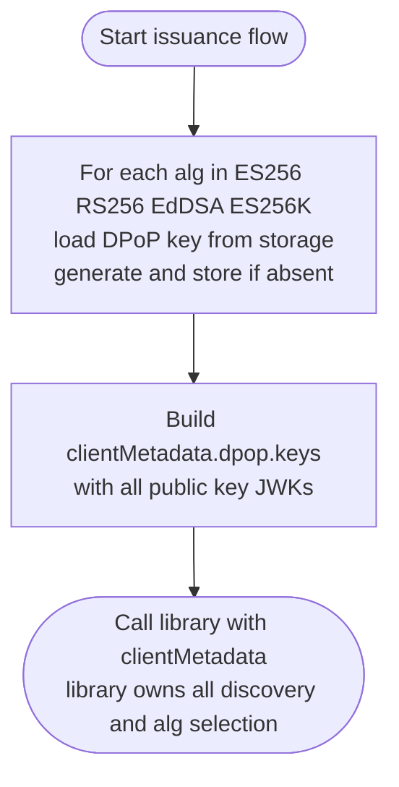
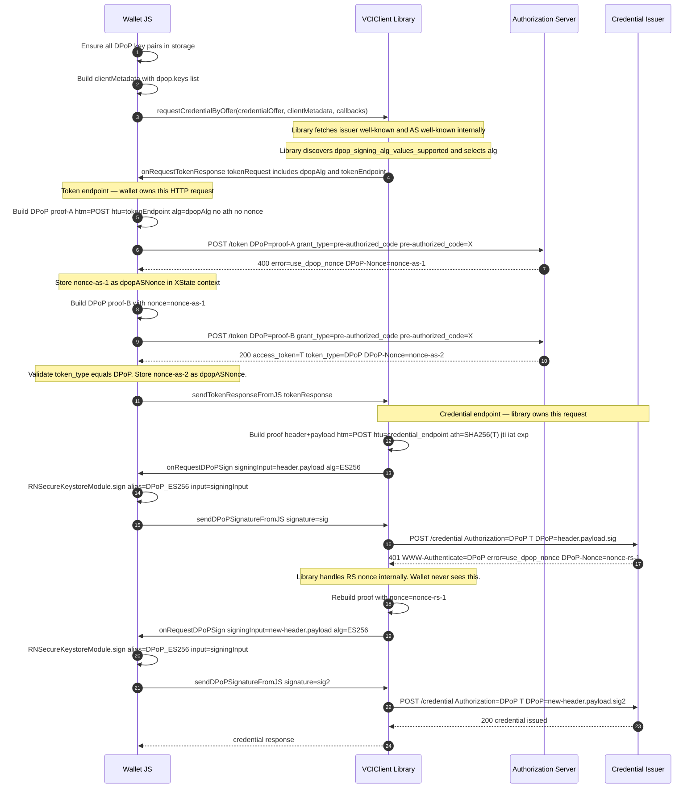
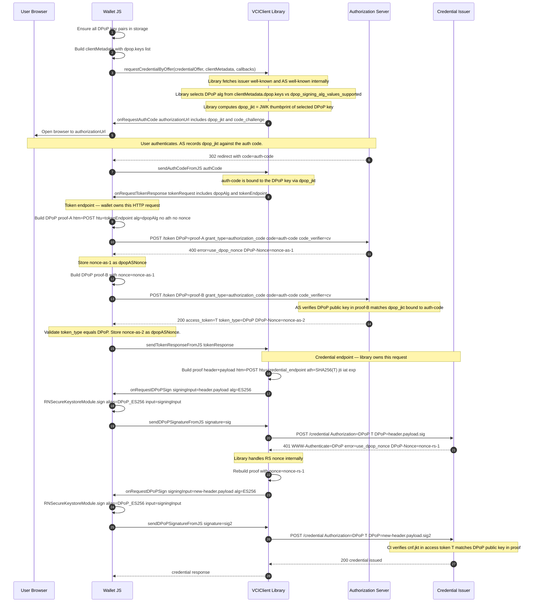
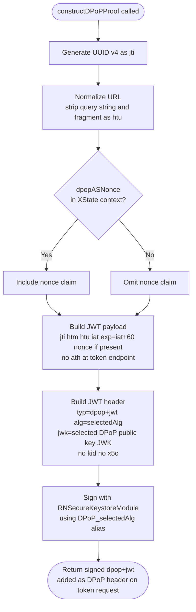
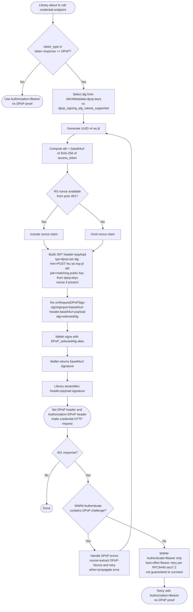
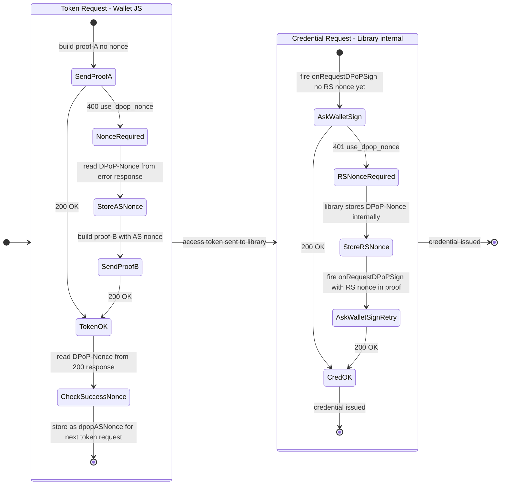
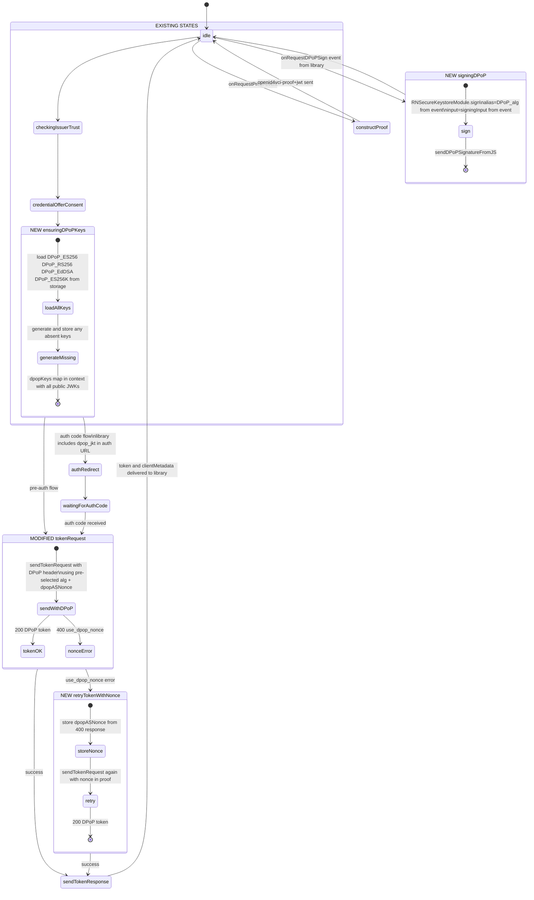
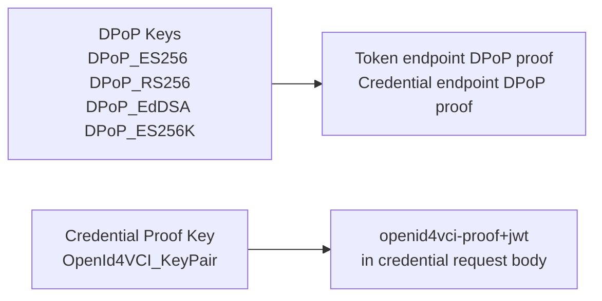

# ADR: DPoP Sender-Constrained Access Tokens (RFC 9449)

| Field               | Value                                                                    |
| ------------------- | ------------------------------------------------------------------------ |
| **Status**          | Proposed                                                                 |
| **Date**            | 2026-06-16                                                               |
| **Spec references** | [RFC 9449](https://www.rfc-editor.org/rfc/rfc9449), OID4VCI 1.0 draft-13 |
| **Branch**          | `feat/dpop`                                                              |

---

## Context

The wallet currently exchanges authorization grants for Bearer access tokens and presents them to the credential endpoint as `Authorization: Bearer <token>`. Bearer tokens are not bound to any client identity — anyone who intercepts or exfiltrates a token can replay it against any resource server.

RFC 9449 (DPoP — Demonstrating Proof of Possession) adds sender-constraint to OAuth 2.0 access tokens by cryptographically binding each token to a client-controlled key pair. The wallet must prove possession of the private key on every request that uses the token. A stolen token is therefore useless without the corresponding private key.

OID4VCI 1.0 draft-13 mandates DPoP support as the mechanism for sender-constrained access tokens at both the authorization server (token endpoint) and the credential issuer (credential endpoint).

### Current gaps

- `sendTokenRequest` (JS) sends a plain `fetch()` with no `DPoP` header.
- The credential endpoint is called by the native `VCIClient` library with `Authorization: Bearer`.
- No DPoP key management, proof construction, or nonce handling exists anywhere.

---

## Decision Drivers

- **Security:** Prevent access token replay after exfiltration (BREACH, Heartbleed, XSS-class attacks as cited in RFC 9449 §2).
- **Interoperability:** Be compatible with AS and RS that enforce `dpop_bound_access_tokens: true`. Support all key types the wallet already has.
- **Spec compliance:** OID4VCI 1.0 d13 requires DPoP for sender-constrained token flows.
- **Minimal disruption:** The token request is already JS-owned. The credential request is native — extend the bridge without forking VCIClient internals.
- **Separation of concerns:** The library knows HTTP context (htm, htu, nonce from RS). The wallet knows keys and signing. Each does what it knows.

---

## Plan

### Split responsibility: library constructs proofs, wallet signs ✓

**Token endpoint (JS-owned):** Wallet constructs the full DPoP proof and adds the `DPoP` header in `sendTokenRequest`. AS nonce is managed entirely in JS.

**Credential endpoint (library-owned):** The VCIClient library constructs DPoP proofs internally — it already knows `htm`, `htu`, `accessToken`, and any RS-provided nonce from 401 responses. The library fires an `onRequestDPoPSign` callback with the `signingInput` (the `header.payload` bytes to sign) and which `alg` it chose. The wallet signs using the matching DPoP key alias and returns the raw signature. The library assembles the final JWT and injects the headers.

**Key negotiation:** The wallet passes all available DPoP public keys (one per supported alg) inside `clientMetadata.dpop.keys`. The library intersects this with `dpop_signing_alg_values_supported` from AS metadata and picks the best match. The wallet never needs to read AS metadata for DPoP key selection.

**Chosen.** Clean separation: library owns protocol (proof structure, RS nonce, retry), wallet owns keys (generation, storage, signing). No new native method parameters — all DPoP config travels inside the existing `clientMetadata` JSON string.

---

## Decision

### Key design

| Concern                                    | Decision                                                                                                                                                                                                                                                                                                 |
| ------------------------------------------ | -------------------------------------------------------------------------------------------------------------------------------------------------------------------------------------------------------------------------------------------------------------------------------------------------------- |
| DPoP key algorithms                        | One persistent key pair per supported alg: `DPoP_ES256`, `DPoP_RS256`, `DPoP_EdDSA`, `DPoP_ES256K`                                                                                                                                                                                                       |
| DPoP key storage                           | `RNSecureKeystoreModule` generic key storage, one alias per alg                                                                                                                                                                                                                                          |
| DPoP key generation                        | Per-alg: generated once on first use, loaded from alias on subsequent flows                                                                                                                                                                                                                              |
| DPoP key rotation                          | **Open question** — RFC 9449 is silent on rotation frequency. Policy TBD (wallet reset / periodic / never)                                                                                                                                                                                               |
| DPoP key vs credential proof key           | Always separate — using the same key for both enables JWT-swapping attacks (read: RFC 9449 §11.5)                                                                                                                                                                                                        |
| Alg selection — credential endpoint        | Library picks from `clientMetadata.dpop.keys` intersected with AS `dpop_signing_alg_values_supported`                                                                                                                                                                                                    |
| Alg selection — token endpoint + dpop_jkt  | Library selects alg (from AS discovery) and passes it to wallet via `dpopAlg` in `onRequestTokenResponse`. Library computes `dpop_jkt` and includes it in the auth URL fired via `onRequestAuthCode`. Wallet does not read AS metadata.                                                                  |
| DPoP config transport                      | Embedded in existing `clientMetadata` JSON as `dpop.keys` — no new native method parameters                                                                                                                                                                                                              |
| clientMetadata ownership                   | Built in `IssuersService` for both flows; `VciClient.ts` no longer hardcodes it                                                                                                                                                                                                                          |
| AS nonce                                   | Wallet JS owns: read from token endpoint response, stored as `dpopASNonce` in XState context                                                                                                                                                                                                             |
| RS nonce                                   | Library owns: extracted from 401 response internally, passed as `signingInput` context to wallet on retry — wallet never stores it                                                                                                                                                                       |
| Auth code binding                          | Library computes `dpop_jkt` from selected DPoP key and includes it in auth URL fired via `onRequestAuthCode` (read: RFC 9449 §10)                                                                                                                                                                        |
| Pre-auth code flow                         | No `dpop_jkt` — just `DPoP` header on token request                                                                                                                                                                                                                                                      |
| DPoP attempt — token endpoint              | Always attempt DPoP on the token request (OID4VCI recommends DPoP). `dpop_signing_alg_values_supported` present → use for alg selection. Absent → use wallet's preference order (ES256 first). Check `token_type` in response to confirm whether AS issued a DPoP-bound or Bearer token.                 |
| Graceful degradation — credential endpoint | Library checks `token_type` from token response. `token_type: "DPoP"` → use DPoP with `ath`. `token_type: "Bearer"` → use Bearer, ignore `clientMetadata.dpop` entirely.                                                                                                                                 |
| RS Bearer-only 401 fallback                | If credential endpoint returns 401 with `WWW-Authenticate: Bearer` only (no DPoP challenge) → spec §7.2 permits retrying with Bearer as best-effort. Not guaranteed — RS could still reject. If `WWW-Authenticate: DPoP` is present (with or without Bearer) → never downgrade, handle DPoP errors only. |

### Open questions

| #    | Question                                                                                                                                                                                                                                                                               | Impact                    |
| ---- | -------------------------------------------------------------------------------------------------------------------------------------------------------------------------------------------------------------------------------------------------------------------------------------- | ------------------------- |
| OQ-1 | **DPoP key rotation frequency** — RFC 9449 is silent. Options: wallet reset, time-based (e.g. 90 days), never.                                                                                                                                                                         | Key management complexity |
| OQ-2 | **AS rejects DPoP header despite OID4VCI recommendation** — wallet sends DPoP, AS returns error (not `use_dpop_nonce`). Should wallet retry as Bearer or hard-fail? Policy call: retrying as Bearer degrades security; hard-failing is safer but breaks interop with non-compliant AS. | Degradation policy        |

---

## DPoP Proof JWT Structure (RFC 9449 §4.2)

```
Header:
{
  "typ": "dpop+jwt",
  "alg": "ES256",
  "jwk": { "kty":"EC", "crv":"P-256", "x":"...", "y":"..." }  ← public key only, no private
}

Payload:
{
  "jti": "<UUID v4>",                    ← unique per proof, never reuse
  "htm": "POST",                         ← HTTP method of the target request
  "htu": "https://issuer.example/token", ← target URI, no query string, no fragment
  "iat": 1718500000,
  "exp": 1718500060,                     ← short-lived: iat + 60s
  "nonce": "aaaa...",                    ← only when server has demanded one
  "ath": "base64url(SHA-256(token))"     ← only at resource server (credential endpoint)
}
```

`ath` is absent on the token endpoint request. Mandatory on the credential endpoint request.

---

## Library API Changes

### `ClientMetadata` struct extension

The VCIClient library's `ClientMetadata` gains an optional `dpop` field. No existing fields change; no new method parameters are added anywhere.

```swift
// VCIClient library — ClientMetadata
struct DPoPKeyEntry: Codable {
  let alg: String           // "ES256" | "RS256" | "EdDSA" | "ES256K"
  let publicKeyJWK: AnyCodable
}

struct DPoPConfig: Codable {
  let keys: [DPoPKeyEntry]  // all DPoP public keys the wallet holds
}

struct ClientMetadata: Codable {
  let clientId: String
  let redirectUri: String
  let dpop: DPoPConfig?     // nil → library uses Bearer only
}
```

Equivalent TypeScript type used by `IssuersService` when building `clientMetadata`:

```typescript
type ClientMetadata = {
  clientId: string;
  redirectUri: string;
  dpop?: {
    keys: Array<{alg: string; publicKeyJWK: object}>;
  };
};
```

### `fetchCredentialsUsingCredentialOffer` / `fetchCredentialsFromTrustedIssuer` — new `signDPoP` closure

The library gains one new optional closure parameter. All existing parameters are unchanged.

```swift
// Added to both fetch methods — nil when dpop is absent from ClientMetadata
signDPoP: ((_ signingInput: String, _ alg: String) async throws -> String)?
```

The library calls this closure each time it needs a DPoP proof signed. It constructs the JWT header and payload internally, serialises to `base64url(header).base64url(payload)`, and passes that as `signingInput`. The wallet returns `base64url(signature)`. The library appends the signature to form the complete JWT.

### `onRequestDPoPSign` event / `sendDPoPSignatureFromJS` receiver

Mirrors the existing `onRequestProof` / `sendProofFromJS` pattern exactly.

```
Native → JS event: onRequestDPoPSign
  { "signingInput": "eyJ...", "alg": "ES256" }

JS → Native receiver: sendDPoPSignatureFromJS
  "MEYCIQDnp3..."   ← base64url(ES256 signature over signingInput bytes)
```

### `clientMetadata` on the wire

```json
{
  "clientId": "wallet",
  "redirectUri": "io.mosip.residentapp.inji://oauthredirect",
  "dpop": {
    "keys": [
      {
        "alg": "ES256",
        "publicKeyJWK": {"kty": "EC", "crv": "P-256", "x": "...", "y": "..."}
      },
      {"alg": "RS256", "publicKeyJWK": {"kty": "RSA", "n": "...", "e": "AQAB"}},
      {
        "alg": "EdDSA",
        "publicKeyJWK": {"kty": "OKP", "crv": "Ed25519", "x": "..."}
      },
      {
        "alg": "ES256K",
        "publicKeyJWK": {
          "kty": "EC",
          "crv": "secp256k1",
          "x": "...",
          "y": "..."
        }
      }
    ]
  }
}
```

If no DPoP keys exist or AS does not support DPoP, `dpop` field is omitted and library falls back to Bearer.

---

## Flow Diagrams

### Flow 1 — DPoP Key Setup (wallet side, before calling library)

Wallet ensures all DPoP key pairs exist in storage and assembles `clientMetadata` with all public keys. Library does all discovery and alg selection internally.



---

### Flow 2 — Pre-Authorized Code Flow with DPoP

Wallet calls the library with `clientMetadata` (which includes all DPoP keys). Library owns all discovery and drives the flow. Wallet responds to events.



---

### Flow 3 — Authorization Code Flow with DPoP

Wallet calls the library with `clientMetadata`. Library owns discovery and builds the auth URL including `dpop_jkt` (it knows the alg from AS metadata). Wallet only navigates and responds to events.



---

### Flow 4 — Token Endpoint DPoP Proof Construction (Wallet JS)

The wallet constructs the full proof for the token endpoint because it owns that HTTP request.



### Flow 5 — Credential Endpoint DPoP Proof Construction (Library)

The library constructs the proof. The wallet only provides the signature.



---

### Flow 6 — Nonce Lifecycle



---

### Flow 7 — XState Machine State Changes



---

## Key Separation



---

## Consequences

### Positive

- Access tokens are sender-constrained — a stolen token is useless without the DPoP private key.
- All four wallet key types (ES256, RS256, EdDSA, ES256K) are available for DPoP — interoperable with any AS regardless of which alg it supports.
- Library handles RS nonce and retry loop — wallet has no RS nonce state to manage.
- No new native method parameters — DPoP config travels inside the existing `clientMetadata` JSON.
- `token_type` in the token response drives the credential endpoint decision — wallet and library don't need to coordinate on a DPoP/Bearer flag separately.
- `dpop_jkt` binding prevents auth code injection (read: RFC 9449 §11.9).
- Nonce support prevents proof pre-generation (read: RFC 9449 §11.2).

### Trade-offs

- **`ensuringDPoPKeys` generates up to four key pairs on first run.** Subsequent flows load from storage — cost is one-time.
- **dpop_jkt alg coordination is implicit.** Wallet and library independently apply the same preference order to the same key list and AS metadata — they must agree. Any divergence in preference order between wallet and library would cause a mismatch.
- **VCIClient library requires changes.** `ClientMetadata.dpop`, `signDPoP` closure, and internal RS nonce handling must be added upstream.
- **`dpop_signing_alg_values_supported` is optional in RFC 9449.** When absent, wallet uses its own preference order (ES256 first) and still attempts DPoP. AS ignores an unrecognised DPoP header and returns a Bearer token if it doesn't support DPoP — `token_type` in the response is the actual outcome signal.
- **Bearer fallback on credential endpoint 401 is best-effort.** RFC 9449 §7.2 uses "would most presumably accept" — a DPoP-aware RS that only sent a Bearer challenge would still reject the downgraded request.

### Non-goals

- DPoP for VP presentation flows (OpenID4VP) — out of scope.
- DPoP for the wallet binding (WLA) endpoint — separate flow.
- Refresh token DPoP binding — wallet does not use refresh tokens in OID4VCI flows today.
