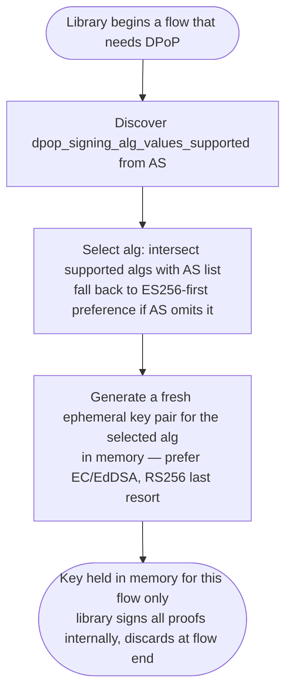
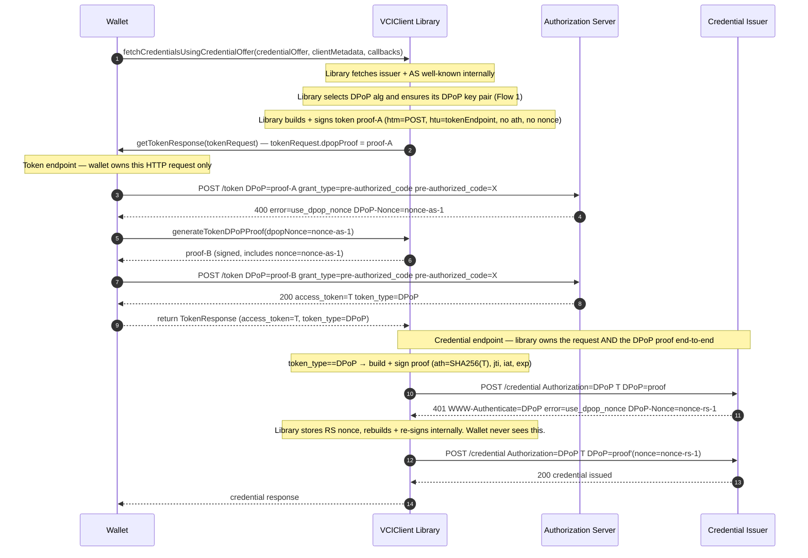
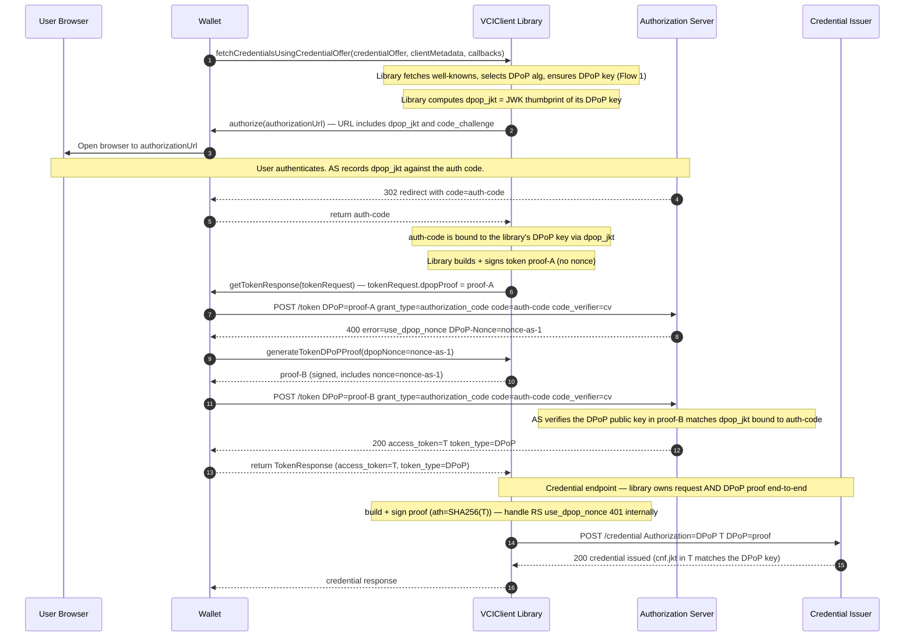
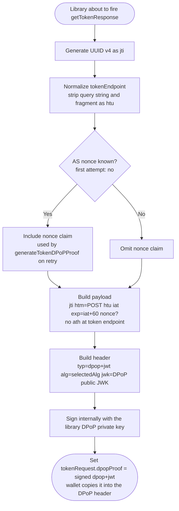
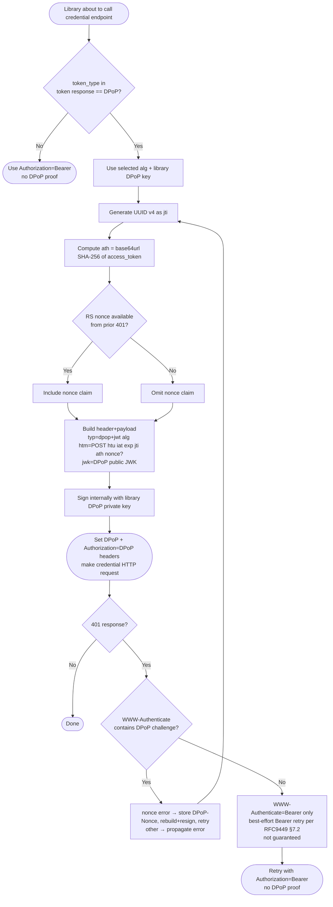
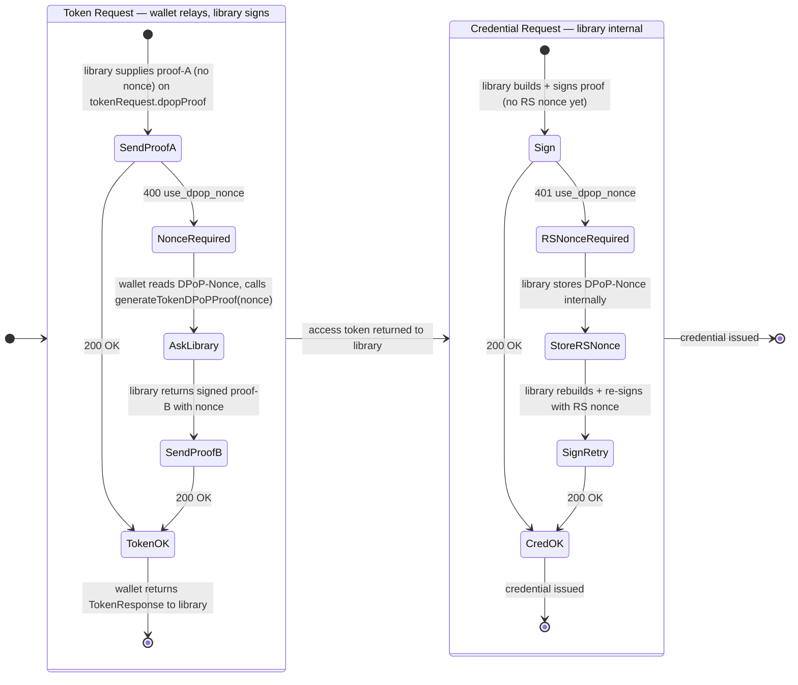
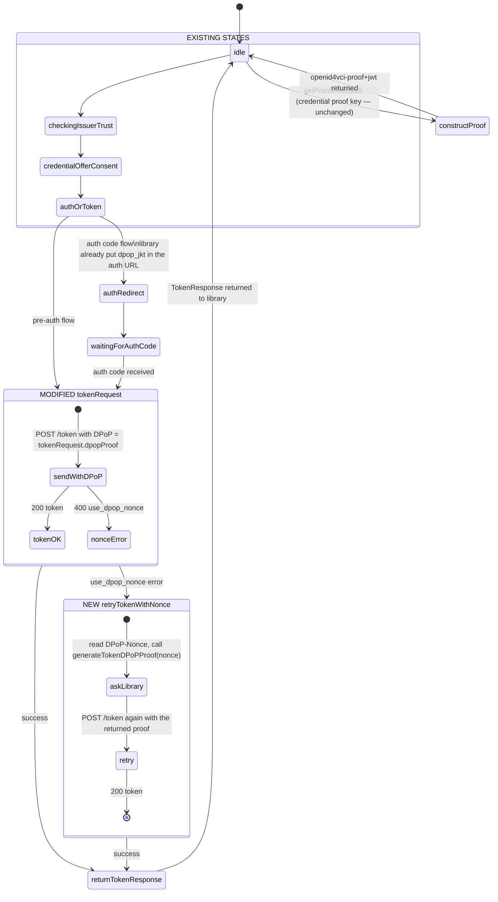
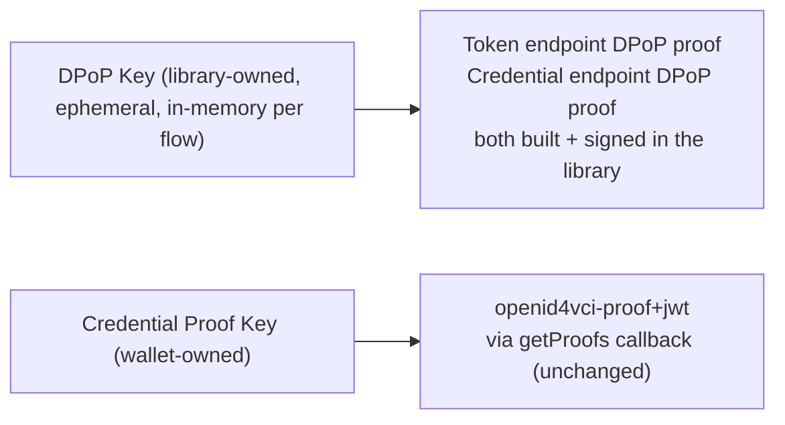

# ADR: DPoP Sender-Constrained Access Tokens (RFC 9449)

| Field               | Value                                                                    |
| ------------------- | ------------------------------------------------------------------------ |
| **Status**          | Proposed                                                                 |
| **Date**            | 2026-06-16                                                               |
| **Spec references** | [RFC 9449](https://www.rfc-editor.org/rfc/rfc9449), OID4VCI 1.0 draft-13 |
| **Branch**          | `feat/dpop`                                                              |

---

## Context

The wallet currently exchanges authorization grants for Bearer access tokens and presents them to the credential endpoint as `Authorization: Bearer <token>`. Bearer tokens are not bound to any client identity — anyone who intercepts or exfiltrates a token can replay it against any resource server.

RFC 9449 (DPoP — Demonstrating Proof of Possession) adds sender-constraint to OAuth 2.0 access tokens by cryptographically binding each token to a client-controlled key pair. The client must prove possession of the private key on every request that uses the token. A stolen token is therefore useless without the corresponding private key.

OID4VCI 1.0 draft-13 mandates DPoP support as the mechanism for sender-constrained access tokens at both the authorization server (token endpoint) and the credential issuer (credential endpoint).

### Current gaps

- The token request is performed by the wallet (the `getTokenResponse` / `TokenResponseCallback`), which sends a plain POST with no `DPoP` header.
- The credential endpoint is called by the native `VCIClient` library with `Authorization: Bearer`.
- No DPoP key management, proof construction, signing, or nonce handling exists anywhere.

---

## Decision Drivers

- **Security:** Prevent access token replay after exfiltration (BREACH, Heartbleed, XSS-class attacks as cited in RFC 9449 §2).
- **Interoperability:** Be compatible with AS and RS that enforce `dpop_bound_access_tokens: true`. Support the algorithms the AS advertises.
- **Spec compliance:** OID4VCI 1.0 d13 requires DPoP for sender-constrained token flows.
- **Single owner for DPoP:** DPoP is a protocol concern — proof structure, nonce handling, retries, key binding, and signing are tightly coupled. Splitting them across the wallet/library boundary (the original "wallet signs via closure" design) creates two state machines that must stay in lockstep. Keeping the **entire** DPoP mechanism inside the library removes that coupling.
- **Minimal wallet surface:** The wallet should not have to learn DPoP. It owns the token HTTP request only because that request is wallet-side today; everything DPoP about it should arrive pre-built.

---

## Plan

### Library owns DPoP end-to-end; wallet only carries the prepared proof ✓

This supersedes the earlier "library constructs, wallet signs via `signDPoP` closure" proposal. Feedback on that design: we do **not** want a signing closure handed to the wallet, and we do not want the wallet to construct or sign DPoP proofs at all. The library prepares **and** signs every DPoP proof.

**DPoP keys (library-owned, ephemeral per flow):** The `VCIClient` library generates a fresh DPoP key pair **in memory at the start of each issuance flow**, uses it for every proof in that flow, and discards it when the flow ends. Nothing is persisted to a keystore. The wallet never holds, passes, or signs with DPoP keys. The same in-memory key signs all three bindings within a flow — `dpop_jkt` in the auth URL, the token-endpoint proof, and the credential-endpoint proof — because the AS and issuer verify those against each other (a per-request key would break the flow).

**Credential endpoint (library-owned HTTP):** The library already owns this request. It builds, signs, sends, and handles the RS nonce retry entirely internally. The wallet is not involved at any point — no callback, no closure.

**Token endpoint (wallet-owned HTTP):** The library builds and signs the token-endpoint DPoP proof and hands the finished proof string to the wallet as a **new field on `TokenRequest`** (`dpopProof`). The wallet attaches it as the `DPoP` header on the POST it already makes. On an AS `use_dpop_nonce` challenge, the wallet calls a small library method, passing the AS-supplied nonce, to obtain a fresh signed proof and retries. The wallet never reads AS metadata, never picks an alg, never touches a key.

**Chosen.** One owner for the whole DPoP mechanism. The wallet's only DPoP responsibility is to copy a string into a header and, on a nonce challenge, ask the library for a new string.

---

## Decision

### Key design

| Concern                                    | Decision                                                                                                                                                                                                                                                                                                                                                          |
| ------------------------------------------ | ----------------------------------------------------------------------------------------------------------------------------------------------------------------------------------------------------------------------------------------------------------------------------------------------------------------------------------------------------------------- |
| DPoP key ownership                         | **Library.** Generated, held, and used for signing entirely inside `VCIClient`. The wallet never sees the private key and never signs.                                                                                                                                                                                                                            |
| DPoP key lifetime                          | **Ephemeral, in memory, one key pair per issuance flow.** Generated at flow start, reused for every proof in the flow, discarded at flow end. Nothing is written to a keystore — no persistence at rest.                                                                                                                                                          |
| DPoP key reuse within a flow               | The **same** in-memory key signs `dpop_jkt` (auth URL), the token-endpoint proof, and the credential-endpoint proof. A per-request key would break the AS/issuer cross-checks (`dpop_jkt` ↔ token proof ↔ `cnf.jkt`).                                                                                                                                             |
| DPoP key rotation                          | Not applicable — a fresh key per flow is inherent rotation. No rotation policy needed.                                                                                                                                                                                                                                                                            |
| DPoP key vs credential proof key           | Always separate — using the same key for both enables JWT-swapping attacks (read: RFC 9449 §11.5). The credential proof key remains wallet-owned and is delivered via the existing `getProofs` callback, unchanged.                                                                                                                                               |
| Alg selection (both endpoints + dpop_jkt)  | Library selects the alg by intersecting its supported algs with the AS `dpop_signing_alg_values_supported` (discovered internally), then generates the ephemeral key for that alg. Falls back to its preference order (ES256 first) when the AS omits the list. Prefer EC/EdDSA — generating an RSA key pair per flow is expensive; treat RS256 as a last resort. |
| Proof construction & signing               | **Library, for every proof** — token endpoint and credential endpoint. Wallet performs no construction and no signing.                                                                                                                                                                                                                                            |
| Transport of token-endpoint proof          | New `dpopProof: String?` field on the existing `TokenRequest` passed to the `getTokenResponse` callback. No new top-level method parameters; no `clientMetadata` changes.                                                                                                                                                                                         |
| AS nonce retry (token endpoint)            | Wallet reads `DPoP-Nonce` from the AS `400 use_dpop_nonce` response and calls a new library method `generateTokenDPoPProof(dpopNonce:)` to get a fresh signed proof, then retries the POST. Wallet relays only the nonce — the library reuses the active flow's endpoint, alg, and ephemeral key.                                                                 |
| RS nonce (credential endpoint)             | Library owns it fully: extracts `DPoP-Nonce` from the 401, rebuilds and re-signs internally, retries. The wallet never sees the RS nonce.                                                                                                                                                                                                                         |
| Auth code binding (`dpop_jkt`)             | Library computes `dpop_jkt` from its own DPoP key and includes it in the authorization URL it builds (read: RFC 9449 §10). Wallet only opens the URL.                                                                                                                                                                                                             |
| Pre-auth code flow                         | No `dpop_jkt` — just the `DPoP` header on the token request, supplied as `tokenRequest.dpopProof`.                                                                                                                                                                                                                                                                |
| DPoP attempt — token endpoint              | Library always attempts DPoP (OID4VCI recommends it). The wallet's POST simply carries whatever `dpopProof` the library supplied. The AS `token_type` in the response is the actual outcome signal (DPoP vs Bearer).                                                                                                                                              |
| Graceful degradation — credential endpoint | Library checks `token_type` from the token response. `token_type: "DPoP"` → use DPoP with `ath`. `token_type: "Bearer"` → use Bearer, skip DPoP entirely. Decided and acted on internally.                                                                                                                                                                        |
| RS Bearer-only 401 fallback                | If the credential endpoint returns 401 with `WWW-Authenticate: Bearer` only (no DPoP challenge) → §7.2 permits a best-effort Bearer retry. If `WWW-Authenticate: DPoP` is present → never downgrade; handle DPoP errors only. All internal to the library.                                                                                                        |

### Open questions

| #    | Question                                                                                                                                                                                                                                                                                                                                           | Impact             |
| ---- | -------------------------------------------------------------------------------------------------------------------------------------------------------------------------------------------------------------------------------------------------------------------------------------------------------------------------------------------------- | ------------------ |
| OQ-1 | **AS rejects the DPoP header despite the OID4VCI recommendation** — library sends DPoP, AS returns an error that is not `use_dpop_nonce`. Should the library retry as Bearer or hard-fail? Retrying degrades security; hard-failing breaks non-compliant AS.                                                                                       | Degradation policy |
| OQ-2 | **In-memory crypto in the library.** `VCIClient` has not previously held keys or signed anything (all signing is delegated to the wallet via `getProofs`). Owning ephemeral DPoP keys requires new in-memory keygen + signing code in both the Swift and Kotlin libraries — but **no** secure persistent storage, since keys never outlive a flow. |
| OQ-3 | **Deferred / resumable issuance.** An in-memory key cannot survive an app restart or a long-deferred credential poll. If deferred issuance (or resuming an interrupted flow) is ever required, that flow would need either a persisted key or a fresh authorization. Out of scope while flows are synchronous.                                     |

---

## DPoP Proof JWT Structure (RFC 9449 §4.2)

```
Header:
{
  "typ": "dpop+jwt",
  "alg": "ES256",
  "jwk": { "kty":"EC", "crv":"P-256", "x":"...", "y":"..." }  ← public key only, no private
}

Payload:
{
  "jti": "<UUID v4>",                    ← unique per proof, never reuse
  "htm": "POST",                         ← HTTP method of the target request
  "htu": "https://issuer.example/token", ← target URI, no query string, no fragment
  "iat": 1718500000,
  "exp": 1718500060,                     ← short-lived: iat + 60s
  "nonce": "aaaa...",                    ← only when server has demanded one
  "ath": "base64url(SHA-256(token))"     ← only at resource server (credential endpoint)
}
```

`ath` is absent on the token endpoint request. Mandatory on the credential endpoint request. The library builds and signs both forms.

---

## Library API Changes

All DPoP construction and signing moves into the library. The wallet-facing surface is two small additions; nothing about `ClientMetadata` or the existing callbacks changes.

### `ClientMetadata` — unchanged

DPoP keys are no longer passed by the wallet, so `ClientMetadata` keeps its current shape:

```swift
public struct ClientMetadata: Codable {
    public let clientId: String
    public let redirectUri: String
}
```

### `TokenRequest` — new `dpopProof` field

The library builds and signs the token-endpoint proof and attaches it to the `TokenRequest` it already passes to the `getTokenResponse` callback. This is the "new param in the token request callback."

```swift
public struct TokenRequest {
    public let grantType: GrantType
    public let tokenEndpoint: String
    public let authCode: String?
    public let preAuthCode: String?
    public let txCode: String?
    public let clientId: String?
    public let redirectUri: String?
    public let codeVerifier: String?
    public let dpopProof: String?   // NEW — signed dpop+jwt for the token POST; nil ⇒ Bearer
}
```

The wallet's `getTokenResponse` implementation copies `tokenRequest.dpopProof` into the `DPoP` request header (when non-nil) and otherwise behaves exactly as today.

### `VCIClient.generateTokenDPoPProof(dpopNonce:)` — new method for the AS nonce retry

When the AS answers the first token POST with `400 use_dpop_nonce` + a `DPoP-Nonce` header, the wallet asks the library for a fresh proof bound to that nonce, then retries. The library rebuilds and re-signs internally with its own key.

```swift
// New public method on VCIClient — used only on a use_dpop_nonce challenge
public func generateTokenDPoPProof(
    dpopNonce: String
) async throws -> String
```

The wallet passes only the nonce. The library already holds the flow's `tokenEndpoint` (the `htu`), selected alg, and ephemeral key from when it built the first proof, so they are not passed back in. **Precondition:** valid only during an active flow — if the ephemeral key is gone (flow ended / app restarted), the call throws rather than mint a new key, since a new key would break the `dpop_jkt` ↔ token-proof ↔ `cnf.jkt` chain.

This is a wallet→library call (the wallet already holds the `VCIClient` instance). It is **not** a closure handed to the wallet, and it never exposes signing material.

### Credential endpoint — no wallet-facing change

The credential request is library-owned HTTP. The library constructs, signs, sends, handles the `use_dpop_nonce` 401, and retries entirely internally. There is **no** `signDPoP` closure and **no** `onRequestDPoPSign` / `sendDPoPSignatureFromJS` bridge event — these are removed from the design.

---

## Flow Diagrams

### Flow 1 — DPoP Key Setup (library internal, ephemeral)

At the start of each flow the library generates a fresh in-memory DPoP key pair for the selected alg. No persistence, no keystore. The wallet does nothing here.



---

### Flow 2 — Pre-Authorized Code Flow with DPoP

The wallet calls the library and only relays HTTP for the token endpoint. The library owns every DPoP concern.



---

### Flow 3 — Authorization Code Flow with DPoP

The library computes `dpop_jkt` from its own key and bakes it into the authorization URL. The wallet only opens the browser and relays the token POST.



---

### Flow 4 — Token Endpoint DPoP Proof Construction (Library)

The library constructs **and signs** the token-endpoint proof. The wallet receives a finished string on `TokenRequest`.



---

### Flow 5 — Credential Endpoint DPoP (Library, fully internal)

The library constructs, signs, sends, and retries. The wallet is not involved.



---

### Flow 6 — Nonce Lifecycle



---

### Flow 7 — XState Machine State Changes (wallet side)

DPoP keys and signing leave the wallet entirely. No `ensuringDPoPKeys` state, no `signingDPoP` state. The only change is inside the existing token-request state.



---

## Key Separation

DPoP keys are owned by the library; the credential proof key stays wallet-owned. They are never the same key.



---

## Consequences

### Positive

- Access tokens are sender-constrained — a stolen token is useless without the DPoP private key.
- **Ephemeral keys have nothing to steal at rest and no rotation policy.** The private key lives only in memory for one flow, so the "long-lived key exfiltrated from the keystore" threat class does not apply, and rotation is inherent.
- **Better privacy / unlinkability.** A fresh `jkt` per flow prevents an AS or issuer from correlating separate issuance flows by a stable key thumbprint.
- **One owner for DPoP.** Proof structure, alg selection, key binding, signing, nonce handling, and retries all live in the library. There is no cross-boundary state to keep in sync and no signing closure handed to the wallet.
- **Wallet surface is tiny.** The wallet copies `tokenRequest.dpopProof` into a header and, on a nonce challenge, calls one library method. It never reads AS metadata, picks an alg, holds a DPoP key, or signs.
- `ClientMetadata` is unchanged; the credential proof callback (`getProofs`) is unchanged.
- `token_type` in the token response drives the credential-endpoint decision internally — no separate DPoP/Bearer flag to coordinate.
- `dpop_jkt` binding prevents auth code injection (read: RFC 9449 §11.9); nonce support prevents proof pre-generation (read: RFC 9449 §11.2).

### Trade-offs

- **The library gains in-memory keygen + signing responsibility it did not have before (OQ-2).** `VCIClient` previously delegated all signing to the wallet via `getProofs`. DPoP now requires in-memory key generation and signing in both the Swift and Kotlin libraries — but no secure persistent storage, since keys never outlive a flow.
- **Ephemeral keys cannot survive an app restart or a long-deferred poll (OQ-3).** Today's flows are synchronous, so this is a non-issue; deferred or resumable issuance would need a persisted key or a fresh authorization.
- **One extra wallet→library round trip on a nonce challenge.** The AS `use_dpop_nonce` path costs a `generateTokenDPoPProof` call before the retry POST. This is the price of keeping the token HTTP request wallet-side while the proof stays library-built.
- **`dpop_signing_alg_values_supported` is optional in RFC 9449.** When absent, the library uses its own preference order (ES256 first) and still attempts DPoP. The AS returns a Bearer token if it does not support DPoP — `token_type` in the response is the actual outcome signal.
- **Bearer fallback on a credential-endpoint 401 is best-effort.** RFC 9449 §7.2 uses "would most presumably accept" — a DPoP-aware RS that only sent a Bearer challenge could still reject the downgraded request.

### Non-goals

- DPoP for VP presentation flows (OpenID4VP) — out of scope.
- DPoP for the wallet binding (WLA) endpoint — separate flow.
- Refresh token DPoP binding — the wallet does not use refresh tokens in OID4VCI flows today.
