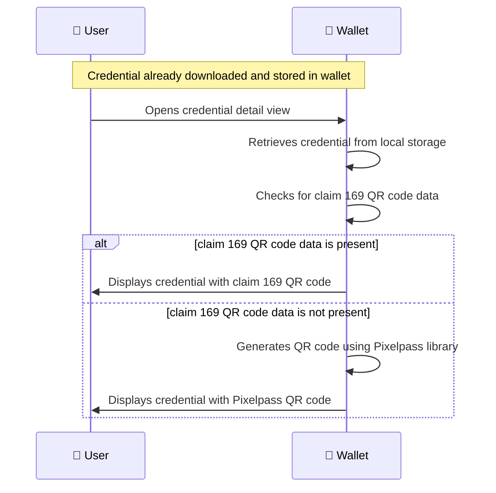

# Claim 169 QR Code Support

## Overview

- Inji Wallet supports the consumption of Claim 169 QR Code, a standardized format that uses CBOR Web Token (CWT) identity-data claim (key 169) to encode digitally signed identity information into QR codes.
- This issuer-generated QR code enables secure, offline verification of identity data, allowing users to present their credentials without requiring network connectivity.
- When displaying the credential detail view, Inji Wallet automatically detects and prioritizes the Claim 169 QR code if present in the VC. If the Claim 169 QR code is not available, the wallet generates a QR code using the Pixelpass library.

## References

- [Claim 169 QR Code Specification](https://docs.mosip.io/1.2.0/readme/standards-and-specifications/mosip-standards/169-qr-code-specification)

## Pre-requisites

- VC should be valid and should contain claim 169 QR code data in the expected format. For e.g. for JSON-LD VC, claim 169 QR code data should be present in the `credentialSubject` section of the VC with the key `claim169`.

  ```json
    "claim169": {
    "identityQRCode": "NCF4:OCFBI%S:2EQ7NMC2558J6HW8VDQ0DW8V27MMSLYG%8WTGTEF9-8G7K6A5S+ORSWH4%F12802...",
    "faceQRCode": "NCF4:OCFBI%S:2EQ7NMC2558J6HW8VDQ0DW8V27MMSLYG%8WTSJSJGTEF9-8G7K6A5S+ORSWH4%F12802..."
    }
  ```

- The claim 169 QR code data should be in the expected format as per the requirements of the application consuming it. Refer [Claim 169 QR Code specification](https://docs.mosip.io/1.2.0/readme/standards-and-specifications/mosip-standards/169-qr-code-specification) for further details.

## Credential Detail view - with Claim 169 QR code support

### Actors Involved

- **User**: The individual who holds the Verifiable Credential and interacts with the Inji Wallet to view the credential details.
- **Wallet**: The application that displays the credential details to the user, including the claim 169 QR code if present.


