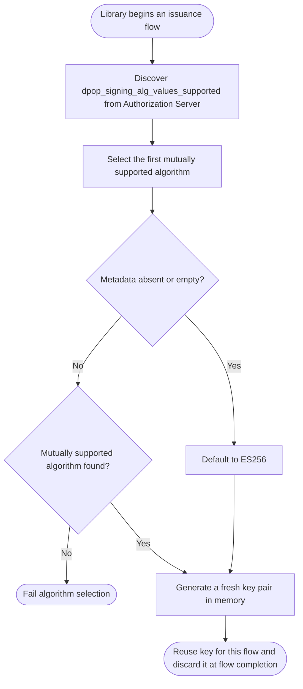
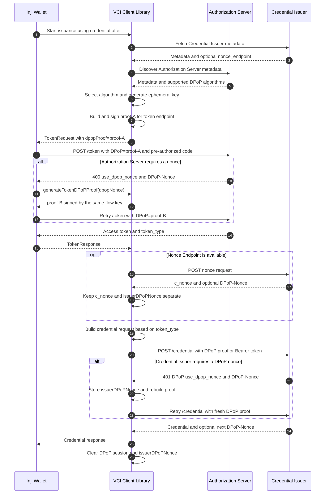
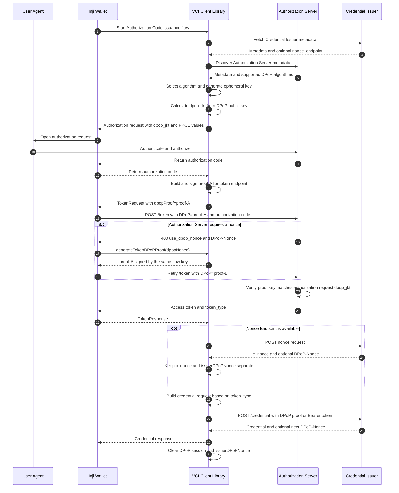
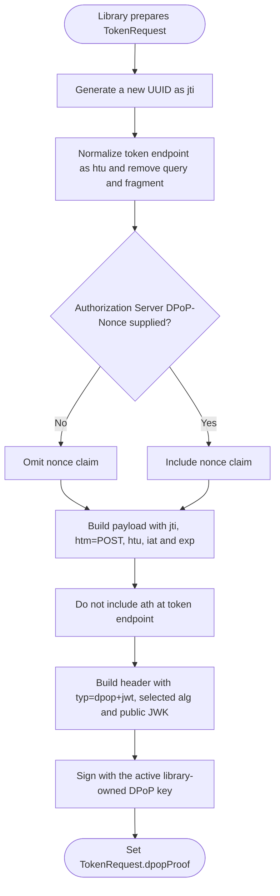
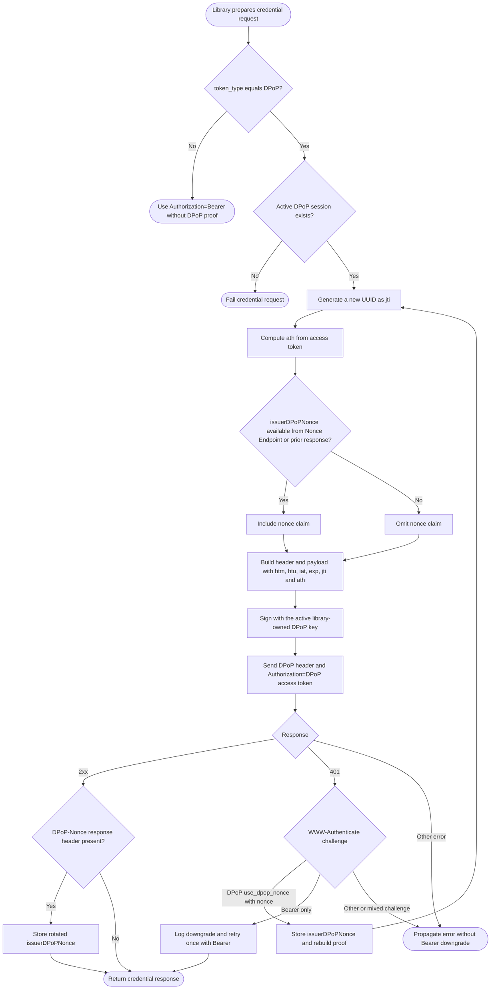
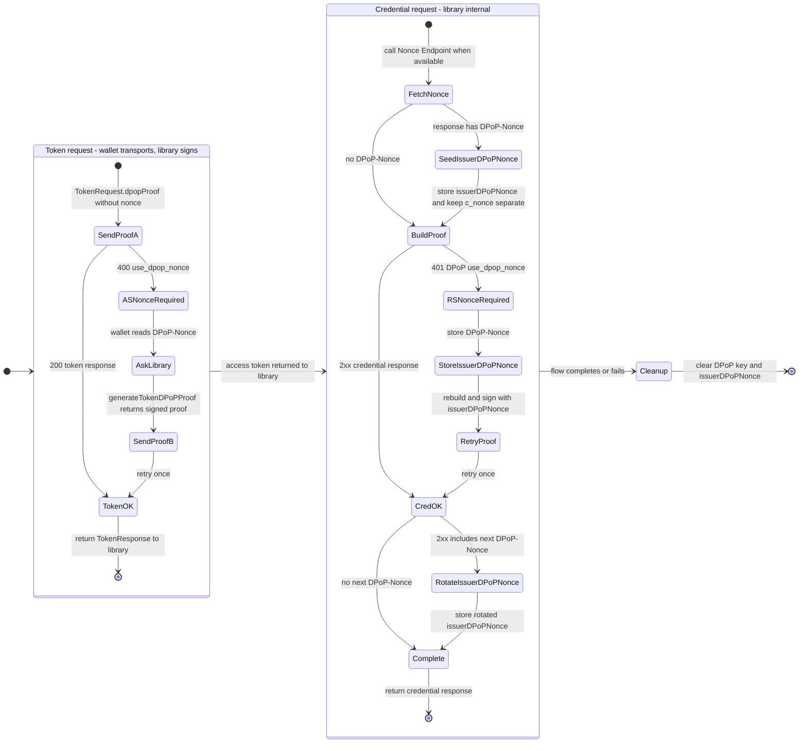
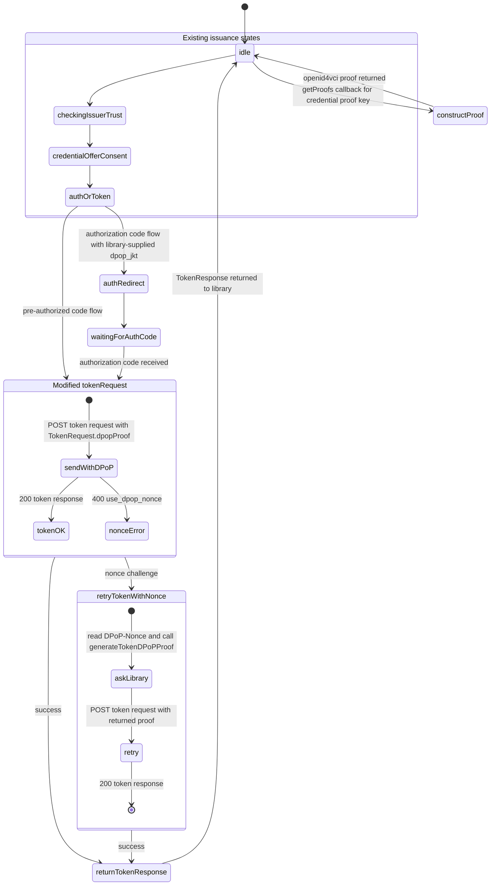
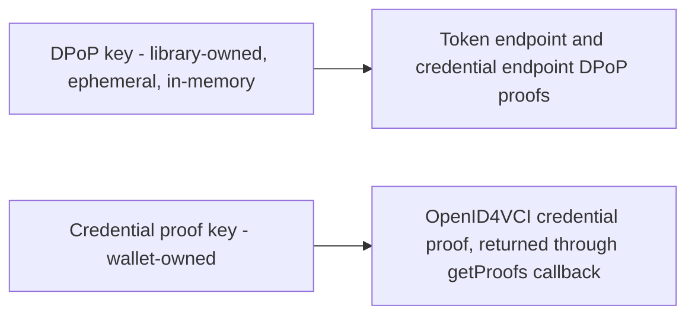
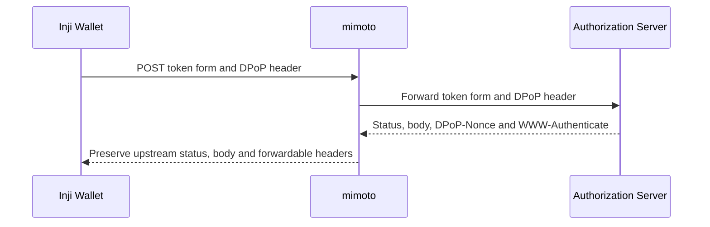

# DPoP Sender-Constrained Access Token Support

This document describes how Inji Wallet supports Demonstrating Proof of Possession (DPoP) for OpenID for Verifiable Credential Issuance (OpenID4VCI) flows.

DPoP binds an OAuth access token to a client-held key. A client presents a request-specific DPoP proof together with the access token, preventing the token from being replayed without the corresponding private key.

The implementation follows:

- [RFC 9449 - OAuth 2.0 Demonstrating Proof of Possession](https://www.rfc-editor.org/rfc/rfc9449)
- [OpenID for Verifiable Credential Issuance 1.0](https://openid.net/specs/openid-4-verifiable-credential-issuance-1_0.html)

## Supported flows

DPoP is supported for both OpenID4VCI issuance grants:

1. Authorization Code Flow
2. Pre-Authorized Code Flow

The wallet can send the token request directly to the Authorization Server or route it through the mimoto `/v2/get-token/{issuer}` endpoint. Credential requests are made by the native VCI client libraries.

## Design goals

- Keep DPoP key generation, algorithm selection, proof construction, and credential-endpoint retry handling inside the VCI client library.
- Keep the wallet-facing API small because the wallet owns only the token HTTP request.
- Use a fresh key for every issuance flow and avoid persistent DPoP key storage.
- Reuse the same key throughout one flow so the authorization request, token request, and credential request remain bound to the same key.
- Preserve existing Bearer-token behavior when the Authorization Server returns a Bearer token.
- Keep DPoP keys separate from the keys used to create OpenID4VCI credential proofs.

## Component responsibilities

| Component                             | Responsibilities                                                                                                                                                                                                                                     |
| ------------------------------------- | ---------------------------------------------------------------------------------------------------------------------------------------------------------------------------------------------------------------------------------------------------- |
| Inji Wallet                           | Sends the token request, copies the library-generated proof into the `DPoP` header, reads an Authorization Server nonce challenge, requests a replacement proof, and retries once.                                                                   |
| Kotlin and Swift VCI client libraries | Discover Authorization Server metadata, select the signing algorithm, create and hold the ephemeral key, calculate `dpop_jkt`, build and sign all DPoP proofs, handle credential-endpoint nonce challenges, and clear DPoP state at flow completion. |
| mimoto, when configured               | Forwards the token form and `DPoP` header to the Authorization Server and returns the upstream status, body, and response headers needed by the wallet.                                                                                              |
| Authorization Server                  | Validates token-endpoint proofs, binds DPoP access tokens to the proof key, and may issue `DPoP-Nonce` challenges.                                                                                                                                   |
| Credential Issuer                     | Validates the DPoP-bound access token and credential-endpoint proof, and may provide or rotate a resource-server DPoP nonce.                                                                                                                         |

## Key lifecycle and algorithm selection

The VCI client library creates one DPoP session for each issuance flow.

1. The library discovers `dpop_signing_alg_values_supported` from the Authorization Server metadata.
2. It selects the first mutually supported algorithm in this preference order:
   - `EdDSA`
   - `ES256K`
   - `ES256`
   - `ES384`
   - `ES512`
   - `RS256`
3. When the metadata value is absent or empty, the library defaults to `ES256` and attempts DPoP.
4. When the Authorization Server advertises a non-empty list without a mutually supported algorithm, the flow fails instead of silently selecting a different algorithm.
5. The library generates a fresh key pair in memory for the selected algorithm.
6. The same key is reused for every DPoP binding in the flow.
7. The library clears the key and stored resource-server nonce when the flow completes or fails.

The key is never written to the wallet keystore. A new flow always receives a new key.

## Wallet and library API boundary

DPoP adds two elements to the wallet-library contract.

### `TokenRequest.dpopProof`

The library includes a completed, signed token-endpoint proof in the token request callback:

```typescript
type TokenRequest = {
  grantType: string;
  tokenEndpoint: string;
  authCode?: string;
  preAuthCode?: string;
  txCode?: string;
  clientId?: string;
  redirectUri?: string;
  codeVerifier?: string;
  dpopProof?: string;
};
```

The wallet copies `dpopProof` into the token POST's `DPoP` header. The wallet does not parse, construct, or sign the proof.

### `generateTokenDPoPProof(dpopNonce)`

When the Authorization Server responds with `400 use_dpop_nonce` and a `DPoP-Nonce` header, the wallet passes that nonce to the active VCI client instance:

```typescript
const proof = await vciClient.generateTokenDPoPProof(dpopNonce);
```

The native Kotlin and Swift methods generate the proof synchronously. The React Native bridge exposes the operation as a promise to TypeScript.

This operation is valid only while an issuance flow is active. It reuses the flow's key, algorithm, and original Authorization Server token endpoint. It fails if no active DPoP session exists rather than creating an unrelated key.

No DPoP key or algorithm is added to `ClientMetadata`, and no wallet signing callback is introduced.

## DPoP proof contents

Each request receives a newly signed proof with a unique `jti`.

| Claim or header | Token endpoint proof                             | Credential endpoint proof                          |
| --------------- | ------------------------------------------------ | -------------------------------------------------- |
| `typ`           | `dpop+jwt`                                       | `dpop+jwt`                                         |
| `alg`           | Selected asymmetric algorithm                    | Same algorithm used by the active flow             |
| `jwk`           | Public DPoP key                                  | Same public DPoP key                               |
| `jti`           | New value for every proof                        | New value for every proof and retry                |
| `htm`           | `POST`                                           | `POST`                                             |
| `htu`           | Authorization Server token endpoint              | Credential endpoint                                |
| `iat`           | Current issue time                               | Current issue time                                 |
| `exp`           | `iat + 60` seconds                               | `iat + 60` seconds                                 |
| `nonce`         | Included after an Authorization Server challenge | Included when supplied by the Credential Issuer    |
| `ath`           | Not included                                     | Base64url-encoded SHA-256 hash of the access token |

The `htu` value is normalized without query or fragment components. Only the public key is included in the proof header.

## Flow diagrams

### Flow 1 - DPoP key setup

At the start of each issuance flow, the library selects an algorithm and generates a fresh in-memory DPoP key pair. The wallet does not generate, persist, or sign with this key.



### Flow 2 - Pre-Authorized Code Flow with DPoP

The Pre-Authorized Code Flow does not have an authorization request, so it does not use `dpop_jkt`. The library owns every DPoP concern while the wallet owns the token HTTP request.



### Flow 3 - Authorization Code Flow with DPoP

For Authorization Code Flow, the library calculates the JWK thumbprint of the active DPoP public key and adds it as `dpop_jkt` to the authorization request. The redirect-based request includes it in the authorization URL; the POST-based interactive authorization request includes it in the request body.



### Flow 4 - Token endpoint DPoP proof construction

The library constructs and signs the token-endpoint proof. The wallet receives a finished proof through `TokenRequest.dpopProof`.



### Flow 5 - Credential endpoint DPoP processing

The library constructs, signs, sends, and retries the credential request. The wallet is not involved in credential-endpoint DPoP processing.



### Flow 6 - Nonce lifecycle

This flow shows the complete implemented nonce lifecycle, including Authorization Server challenges, Nonce Endpoint seeding, Credential Issuer challenges, successful-response rotation, and cleanup.



### Flow 7 - Wallet XState changes

DPoP keys and signing stay outside the wallet state machine. There is no key-generation or DPoP-signing state in the wallet; only the existing token-request path changes.



## Key separation

The library-owned DPoP key and wallet-owned credential proof key are always separate.



## Optional mimoto token transport

For configured issuers, the wallet sends the token form and library-generated `DPoP` header to mimoto's `/v2/get-token/{issuer}` endpoint.



The proof remains bound to the Authorization Server's token endpoint. mimoto transports it to that endpoint and does not create or modify the proof. Preserving `DPoP-Nonce` allows the wallet to perform the same nonce retry used in the direct path.

The legacy mimoto v1 token endpoint retains its existing behavior.

## Credential request and `token_type`

The token response controls the credential request:

| Token response                                   | Credential request behavior                                                                             |
| ------------------------------------------------ | ------------------------------------------------------------------------------------------------------- |
| `token_type: DPoP`                               | Use `Authorization: DPoP <access-token>` and include a credential-endpoint DPoP proof containing `ath`. |
| `token_type: Bearer`, another value, or no value | Use the existing Bearer credential request without a DPoP proof.                                        |

When `token_type` is `DPoP`, the library requires the flow's DPoP session to still be active. A missing session is treated as an error because a new key would not match the access token binding.

## Nonce handling

`c_nonce` and `DPoP-Nonce` serve different purposes and are tracked separately:

- `c_nonce` is used by the wallet-created proof of possession included in the credential request body.
- `DPoP-Nonce` is used by DPoP proofs sent in HTTP headers.

### Authorization Server nonce

1. The wallet initially sends the proof supplied in `TokenRequest.dpopProof`.
2. On `400 use_dpop_nonce` with `DPoP-Nonce`, the wallet requests a new proof from the library.
3. The wallet retries the token request once with the new proof.
4. Missing nonce headers, non-DPoP errors, or a failed retry are returned through the existing VCI error contract.

### Credential Issuer nonce

The library owns the Credential Issuer DPoP nonce as `issuerDPoPNonce`. This is distinct from
`c_nonce`, which is the OpenID4VCI credential issuer nonce used in the credential proof, and from
`asDPoPNonce`, the Authorization Server DPoP nonce used at the token endpoint.

1. If the OpenID4VCI Nonce Endpoint returns a `DPoP-Nonce` response header, the library stores it while separately returning the body `c_nonce`.
2. The first credential-endpoint proof includes the stored `issuerDPoPNonce`, when present.
3. On `401` with `WWW-Authenticate: DPoP`, `error="use_dpop_nonce"`, and `DPoP-Nonce`, the library rebuilds the proof and retries once.
4. A successful credential response can provide the next `DPoP-Nonce`; the library stores it for a subsequent credential request in the same flow.
5. The nonce is cleared with the DPoP session at the end of the flow.

Authorization Server and Credential Issuer DPoP nonces are not interchangeable.

## Bearer fallback behavior

The library uses the following credential-endpoint behavior for an access token returned with `token_type: DPoP`:

1. A DPoP `use_dpop_nonce` challenge with a nonce is retried once using a fresh DPoP proof.
2. A challenge that advertises only `Bearer` and does not advertise `DPoP` is retried once using `Authorization: Bearer` without a `DPoP` header.
3. A DPoP challenge never triggers a Bearer downgrade.
4. Mixed DPoP and Bearer challenges remain on the DPoP path.
5. Other failures are propagated without retry.

The Bearer-only retry is an intentional compatibility behavior and is logged as a security-relevant event by the native libraries.

## Error handling

| Scenario                                                             | Behavior                                                            |
| -------------------------------------------------------------------- | ------------------------------------------------------------------- |
| Authorization Server advertises no mutually supported DPoP algorithm | Fail algorithm selection.                                           |
| `generateTokenDPoPProof` is called outside an active flow            | Reject the bridge call with a VCI client error.                     |
| Token endpoint returns `use_dpop_nonce` without `DPoP-Nonce`         | Do not retry; propagate the token error.                            |
| Token endpoint nonce retry fails                                     | Propagate the second token response through the VCI error contract. |
| Credential endpoint returns a valid DPoP nonce challenge             | Rebuild the proof and retry once.                                   |
| `token_type: DPoP` is received without an active DPoP session        | Fail the credential request.                                        |
| Credential endpoint returns only a Bearer challenge                  | Perform the intentional one-time Bearer retry.                      |

## Security characteristics

- The private DPoP key exists only in library memory for the duration of one issuance flow.
- A new key per flow reduces correlation across separate issuance sessions.
- The same key is used for `dpop_jkt`, token proof, and credential proof within a flow.
- Credential-endpoint proofs include `ath`, binding the proof to the access token.
- Each proof has a fresh `jti` and short validity window.
- DPoP keys remain separate from credential proof keys.
- Private key material is never included in a DPoP proof or exposed through the React Native bridge.

## Implementation locations

| Area                                 | Location                                                                                           |
| ------------------------------------ | -------------------------------------------------------------------------------------------------- |
| Wallet token request and nonce retry | `shared/openId4VCI/TokenService.ts`                                                                |
| Wallet VCI client wrapper            | `shared/vciClient/VciClient.ts`                                                                    |
| Android React Native bridge          | `android/app/src/main/java/io/mosip/residentapp/InjiVciClientModule.java` and `VCIClientBridge.kt` |
| iOS React Native bridge              | `ios/RNVCIClientModule.swift` and `ios/RNVCIClientModule.m`                                        |
| Kotlin DPoP implementation           | [`inji/inji-vci-client`](https://github.com/inji/inji-vci-client)                                  |
| Swift DPoP implementation            | [`inji/inji-vci-client-ios-swift`](https://github.com/inji/inji-vci-client-ios-swift)              |
| Optional token proxy                 | [`inji/mimoto`](https://github.com/inji/mimoto), `/v2/get-token/{issuer}`                          |

## Out of scope

- DPoP for OpenID4VP presentation flows
- DPoP for Wallet Local Authentication or wallet-binding endpoints
- Refresh-token flows
- Persistent DPoP keys
- Resuming an issuance flow after the in-memory DPoP session is lost
- Long-running deferred issuance that must survive application restart
