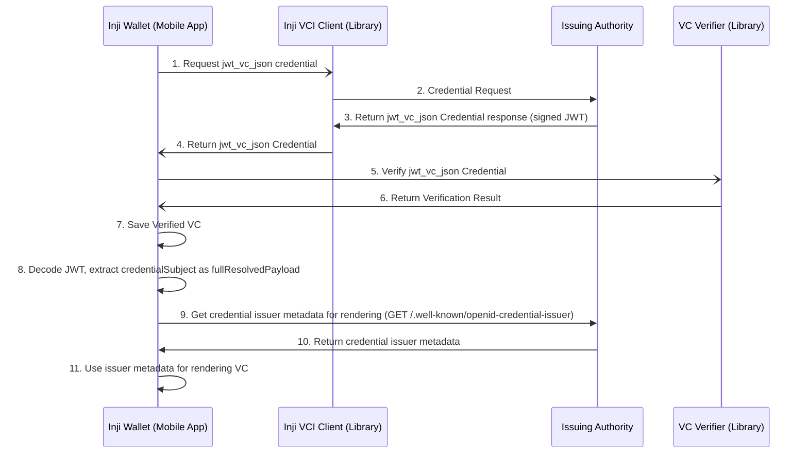

## Support of credential format jwt_vc_json in Inji Wallet

This document provides a comprehensive overview of the process for downloading and rendering a `jwt_vc_json` credential, adhering to the OpenID4VCI specification.

### Scope

- `jwt_vc_json` credential format download, processing, and rendering in Inji Wallet.
- The credential is issued as a signed JWT whose payload wraps a W3C Verifiable Credential under the `vc` claim. The `credentialSubject` is extracted from `payload.vc.credentialSubject`.
- Cryptographic Key Binding - JWK is used for proof of possession in the credential request.

### Actors involved

1. Inji Wallet
2. Issuing Authority
3. _inji-vci-client_ (Library for downloading credential)
4. _vc-verifier_ (Library for verification of the downloaded VC)

### Sequence diagram - Download & view jwt_vc_json credential format VC for Wallet Initiated Flow



#### Steps involved

##### 1. Make credential request

Establish communication with the _inji-vci-client_ to submit a credential request to the issuing authority.

##### 2. Credential Request

The _inji-vci-client_ submits the credential request to the issuing authority.

```json
{
  "format": "jwt_vc_json",
  "credential_definition": {
    "type": ["VerifiableCredential", "ExampleCredential"]
  },
  "proof": {
    "proof_type": "jwt",
    "jwt": "eyJhbGciOiJFZERTQSIsInR5cCI6Im9wZW5pZDR2Y2ktcHJvb2Yrand0IiwiandrIjp7Li4ufX0..."
  }
}
```

##### 3. Receive the Credential Response

The _inji-vci-client_ receives the credential response as a signed JWT string.

```json
{
  "credential": "eyJ0eXAiOiJKV1QiLCJhbGciOiJFUzI1NiIsImtpZCI6ImV4YW1wbGVLZXkifQ.eyJ2YyI6eyJAY29udGV4dCI6WyJodHRwczovL3d3dy53My5vcmcvMjAxOC9jcmVkZW50aWFscy92MSJdLCJpZCI6Imh0dHBzOi8vY3JlZGVudGlhbC1pc3N1ZXIuZXhhbXBsZS5jb20vY3JlZGVudGlhbHMvMzczMiIsInR5cGUiOlsiVmVyaWZpYWJsZUNyZWRlbnRpYWwiLCJFeGFtcGxlQ3JlZGVudGlhbCJdLCJpc3N1ZXIiOiJodHRwczovL2NyZWRlbnRpYWwtaXNzdWVyLmV4YW1wbGUuY29tIiwiaXNzdWFuY2VEYXRlIjoiMjAyNS0wMS0wMVQwMDowMDowMFoiLCJjcmVkZW50aWFsU3ViamVjdCI6eyJpZCI6ImRpZDpleGFtcGxlOjEyMyIsImdpdmVuX25hbWUiOiJKb2huIiwiZmFtaWx5X25hbWUiOiJEb2UiLCJlbWFpbCI6ImpvaG5AZXhhbXBsZS5jb20ifSwiZGVncmVlIjp7InR5cGUiOiJCYWNoZWxvckRlZ3JlZSIsIm5hbWUiOiJCYWNoZWxvciBvZiBTY2llbmNlIGFuZCBBcnRzIn19LCJpc3MiOiJodHRwczovL2NyZWRlbnRpYWwtaXNzdWVyLmV4YW1wbGUuY29tIiwibmJmIjoxNzM1Njg5NjAwLCJqdGkiOiJodHRwczovL2NyZWRlbnRpYWwtaXNzdWVyLmV4YW1wbGUuY29tL2NyZWRlbnRpYWxzLzM3MzIiLCJzdWIiOiJkaWQ6ZXhhbXBsZToxMjMifQ.k13xQCnQIKAIuwQIbg37dwlNr8D6_2YUQtDTVQCq-ZsjcXxHagGC_VIZtd7RpR8OvBzTBHVwrBRD-_RzoV2Ofg"
}
```

The decoded JWT payload:

```json
{
  "vc": {
    "@context": [
      "https://www.w3.org/2018/credentials/v1",
      "https://www.w3.org/2018/credentials/examples/v1"
    ],
    "id": "https://credential-issuer.example.com/credentials/3732",
    "type": ["VerifiableCredential", "UniversityDegreeCredential"],
    "issuer": "https://credential-issuer.example.com",
    "issuanceDate": "2025-01-01T00:00:00Z",
    "credentialSubject": {
      "id": "did:jwk:eyJraWQiOiJ1cm46aWV0ZjpwYXJhbXM6b2F1dGg6andrLXRodW1icHJpbnQ6c2hhLTI1NjpWYkpPU3ZqeFU2TDhDN0dVTzRkc2hJWVYzemJ2RndrWUI0M1lKNUt0dDhFIiwia3R5IjoiRUMiLCJjcnYiOiJQLTI1NiIsImFsZyI6IkVTMjU2IiwieCI6Ik1kQy1PS3E0QVFKZlZDWDV6cFFvTDhqNFZFZnZQWDk4dFU5aHhjTlhHcm8iLCJ5IjoibnNXbmZiNk5Xc0szOUJILWhBYVNrQ1NlNEJ5bWVOc2NKRV9zYUQzRDNiTSJ9",
      "degree": {
        "type": "BachelorDegree",
        "name": "Bachelor of Science and Arts"
      }
    }
  },
  "iss": "https://credential-issuer.example.com",
  "nbf": 1735689600,
  "jti": "https://credential-issuer.example.com/credentials/3732",
  "sub": "did:jwk:eyJraWQiOiJ1cm46aWV0ZjpwYXJhbXM6b2F1dGg6andrLXRodW1icHJpbnQ6c2hhLTI1NjpWYkpPU3ZqeFU2TDhDN0dVTzRkc2hJWVYzemJ2RndrWUI0M1lKNUt0dDhFIiwia3R5IjoiRUMiLCJjcnYiOiJQLTI1NiIsImFsZyI6IkVTMjU2IiwieCI6Ik1kQy1PS3E0QVFKZlZDWDV6cFFvTDhqNFZFZnZQWDk4dFU5aHhjTlhHcm8iLCJ5IjoibnNXbmZiNk5Xc0szOUJILWhBYVNrQ1NlNEJ5bWVOc2NKRV9zYUQzRDNiTSJ9"
}
```

##### 4. Return the Credential Response

Once the response is received in _inji-vci-client_, it is returned to the Wallet.

##### 5. Perform VC verification

After obtaining the credential from the issuing authority through the _inji-vci-client_ library, a verification process ensures that the issued Verifiable Credential (VC) remains unaltered. The following validations are performed using the _vc-verifier_ library:

1. [x] Confirm the credential is not tampered with. (Cryptographic Signature Verification)

- **Android** — delegates to the _vc-verifier_ native library, which performs cryptographic signature verification of the JWT.
- **iOS** — ⚠️ **Signature verification is skipped entirely.** On iOS, `jwt_vc_json` credentials (along with `mso_mdoc`, `vc+sd-jwt`, and `dc+sd-jwt`) are accepted unconditionally without any cryptographic verification. A tampered or forged credential will pass this step and be saved to the Wallet. This is a known limitation — the Digital Bazaar library used on iOS does not support the signature schemes required for these formats, and this behaviour is temporary until VcVerifier is implemented for iOS.

##### 6. Return Verification Result

The verification result is returned to the Wallet.

##### 7. Save Verified VC

If verification succeeds, the credential is saved to the Wallet's store.

##### 8. Decode JWT, extract credentialSubject as fullResolvedPayload

The raw JWT credential is decoded and the `credentialSubject` is extracted from `payload.vc.credentialSubject`. This is stored as `fullResolvedPayload` on the processed credential and is used for all subsequent field rendering.

##### 9. Get credential issuer metadata for rendering

The Wallet fetches the issuer's well-known configuration to determine how the credential should be displayed.

```
GET credentialIssuer/.well-known/openid-credential-issuer
```

##### 10. Return credential issuer metadata

The issuing authority returns the well-known metadata, which includes field labels, ordering, and display properties.

```json
{
  "credential_configurations_supported": {
    "ExampleCredential": {
      "format": "jwt_vc_json",
      "order": ["given_name", "family_name", "email"],
      "credential_definition": {
        "credentialSubject": {
          "given_name": {"display": [{"name": "Given Name", "locale": "en"}]},
          "family_name": {"display": [{"name": "Family Name", "locale": "en"}]},
          "email": {"display": [{"name": "Email", "locale": "en"}]}
        }
      }
    }
  }
}
```

##### 11. Use issuer metadata for rendering VC

The Wallet uses the cached issuer metadata to render the credential. Field ordering is driven by the `order` array if present, otherwise by the keys of `credential_definition.credentialSubject`. Field labels are resolved from each field's `display` array using the wallet's active locale.

### Processing and Rendering

#### Field Ordering

Field ordering for `jwt_vc_json` is resolved from `matchingWellknownDetails` — the entry in `credential_configurations_supported` that matches the selected `credentialConfigurationId` — using the following fallback chain:

1. **`matchingWellknownDetails.order`** — if the `order` array is present and non-empty, those field names are used as-is.
2. **`matchingWellknownDetails.credential_definition.credentialSubject`** — if `order` is absent, the keys of `credentialSubject` are used as the ordered field list, provided at least one key is present.
3. **Default fields** — if neither `order` nor `credential_definition.credentialSubject` yields any fields, the wallet falls back to a pre-configured default field list.

#### Field Label Resolution

- Labels are resolved from the issuer's well-known metadata by traversing `credential_definition.credentialSubject.<field-path>.display`.
- If no `display` metadata exists for a field, the last segment of the field path is formatted as a human-readable label (e.g., `givenName` → `Given Name`).

#### Face / Photo Field

The wallet inspects the resolved credential claims for a face/photo field by recursively searching for a key matching `face`, `photo`, `picture`, `portrait`, or `image` that holds a string value (typically a base64-encoded image).

### Out of scope

- **Revocation** — Inji Wallet does not support revocation for any credential format. This document does not cover revocation of `jwt_vc_json` credentials.
- **SVG Rendering** — Inji Wallet does not support SVG rendering for any credential format. This document does not cover SVG rendering of `jwt_vc_json` credentials.
- **OpenID4VP presentation** — Presentation of `jwt_vc_json` credentials to a Verifier is not covered in this document.
