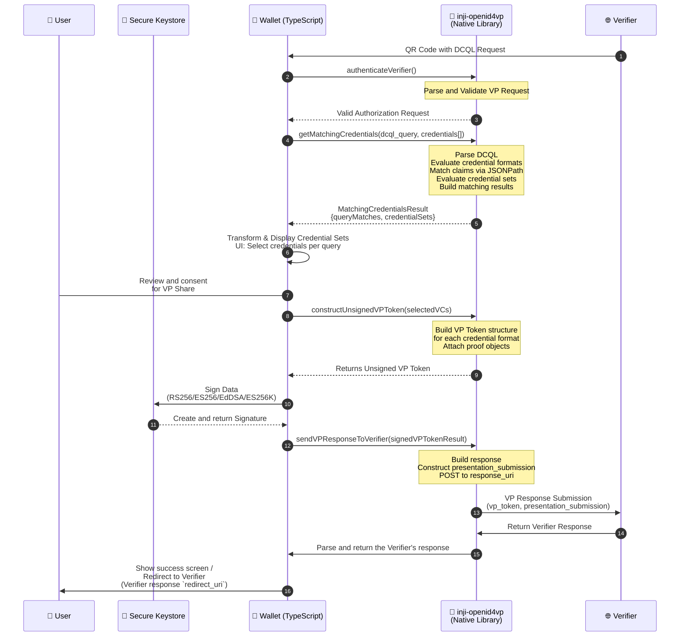
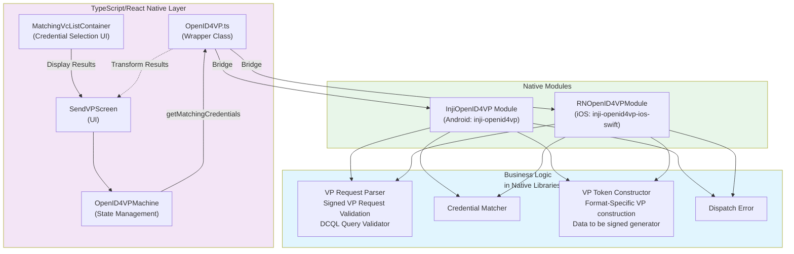

# OpenID4VP - DCQL Query Support

This document provides comprehensive documentation on Inji Wallet's support for **Digital Credentials Query Language (DCQL)** as part of the OpenID4VP specification. DCQL enables verifiers to define complex, declarative queries for requesting credentials with fine-grained claim matching and credential set management.

## Overview

**DCQL (Digital Credentials Query Language)** is a flexible way for verifiers to request digital credentials from a wallet. Unlike traditional approaches that request predefined credentials, DCQL allows verifiers to define multiple ways a user can satisfy a requirement while supporting privacy-preserving data sharing.

### Key Capabilities

#### Credential Sets

- DCQL allows verifiers to define multiple acceptable combinations of credentials that can satisfy a request. This provides flexibility to users by offering alternative ways to prove the same requirement.
- _Example:_

  To prove identity, a user may share:

  - National ID, **or**
  - Passport, **or**
  - Student ID + Parent National ID + Student–Parent Relationship Credential

The wallet can present these options to the user and allow them to choose the most appropriate set of credentials.

#### Claim Sets (Minimal Disclosure)

- DCQL supports alternative claim requirements within a credential, enabling the verifier to obtain only the information necessary to verify a condition.

A credential satisfies the request if any one of the specified claim set alternatives matches.

**Example:**

To verify that a user is above 18 years of age, a verifier may accept:

- `age_over_18`, **or**
- `birthDate`

This design encourages minimal disclosure, allowing the wallet to share the least amount of information required to satisfy the verifier's condition.

#### Multiple Credential Support

- DCQL can specify whether multiple credentials may be used as part of a single credential query. This allows users to combine information from multiple credentials when needed to satisfy a verifier's requirements.

#### Required and Optional Requests

- Verifiers can mark credential requests as either required or optional.

- Optional credentials are considered "nice to have" and can improve the user experience without blocking the presentation flow.
- _Example:_

  When purchasing a new SIM card:

  - Proof of identity may be mandatory.
  - An additional Mobile ID may be optional and used to pre-fill customer information if available.

#### Explicit Credential Matching

DCQL supports clear credential-sharing requirements:

- All required credentials must satisfy the query conditions.
- Partial fulfillment of a required credential request is not allowed.
- Credential matching rules are explicitly defined, reducing ambiguity during presentation.

#### Cryptographic Holder Binding

- Verifiers can specify whether proof of credential ownership is required.

- When enabled, the wallet must demonstrate that the presenter is the legitimate holder of the credential through cryptographic verification.

#### Metadata Filtering

- Credential selection can be filtered based on credential metadata.
- **Example:** A verifier may request only credentials whose type is: Insurance Credential
- This helps narrow credential selection to specific credential categories without inspecting the claims themselves.

---

## DCQL in Inji Wallet

In **Inji Wallet**, the complex DCQL processing—including query evaluation, credential matching, and cryptographic validation—is handled by Inji OpenID4VP library integration.

The TypeScript layer focuses on user experience and orchestration by:

- Presenting credential-sharing requests to the user
- Displaying available credential options
- Allowing users to select credentials that satisfy the request
- Coordinating communication with the native libraries

This separation keeps the application layer simple while ensuring that security-sensitive operations are handled by specialized native components.

## Architecture Overview

### Library-Based Approach: Heavy Lifting by Native Libraries

The Inji Wallet uses a **two-layer architecture** where the native libraries perform all critical operations:

#### Native OpenID4VP Libraries

The Inji Wallet relies on platform-specific native OpenID4VP libraries to handle the core credential presentation workflow and DCQL processing.

- **Android:** `inji-openid4vp` (Kotlin/Java)
- **iOS:** `inji-openid4vp-ios-swift` (Swift)

These libraries are responsible for:

- Parsing and validating Verifiable Presentation (VP) requests received from verifiers.
- Evaluating DCQL queries and identifying credentials that satisfy the requested conditions.
- Supporting multiple credential formats, including `ldp_vc`, `mso_mdoc`, `vc_sd_jwt`, and `dc_sd_jwt`.
- Performing credential matching, claim selection, and disclosure evaluation.
- Constructing Verifiable Presentation (VP) tokens in the appropriate format.
- Building and submitting presentation responses back to the verifier.

By centralizing these responsibilities in native libraries, Inji Wallet ensures consistent, secure, and standards-compliant OpenID4VP and DCQL processing across Android and iOS platforms.

#### Wallet Layer: TypeScript/React Native

The wallet application layer (TypeScript/React Native) focuses on:

- **UI/UX orchestration** for credential selection
- **State management** using XState machines
- **User consent flows** and verification trust management
- **Signature generation** by bridging to native crypto modules
- **Response coordination** with the native OpenID4VP library

---

## DCQL Query Support Features

### 1. Query Structure

A typical DCQL request contains:

```json
{
  "dcql_query": {
    "query": [
      {
        "id": "query-1",
        "credentials": [
          {
            "format": "ldp_vc",
            "claims": [
              {
                "id": "claim-1",
                "path": ["credentialSubject", "givenName"],
                "values": ["John"]
              },
              {
                "id": "claim-2",
                "path": ["credentialSubject", "familyName"]
              }
            ]
          }
        ]
      }
    ],
    "credential_sets": [
      {
        "options": [["query-1"]],
        "required": true
      }
    ]
  }
}
```

### 2. Credential Matching Algorithm

The native libraries implement sophisticated credential matching:

1. **Format Matching:** Filter credentials by requested format
2. **Claim Matching:** Evaluate each claim path against credential structure
3. **Value Matching:** For claims with specific values, verify exact matches
4. **Multiple Credential Support:** Allow multiple credentials to satisfy complex queries
5. **Set Satisfaction:** Ensure credential sets meet mandatory/optional requirements

### 3. Claim Path Resolution

The wallet handles complex claim paths using JSONPath expressions:

```typescript
// Example paths handled by library
['credentialSubject', 'givenName'][('credentialSubject', null, 'givenName')][ // Simple nested property // Array wildcard match
  ('credentialSubject', 0, 'givenName')
]; // Specific array index
```

### 4. Credential Sets and Options

DCQL supports credential set options that define combinations:

```json
{
  "credential_sets": [
    {
      "options": [
        ["query-1"], // Option 1: Single credential from query-1
        ["query-2", "query-3"] // Option 2: Credentials from both queries
      ],
      "required": true // This set is mandatory
    }
  ]
}
```

---

## Implementation Architecture

### Flow: DCQL Query Processing



### Component Integration Architecture



---

## DCQL Flow Handling in Wallet

### Step 1: Request Reception & Validation

This flow is same as openid4vp support

**File:** `shared/openID4VP/OpenID4VP.ts`

The wallet receives a VP Request by either scanning Verifier QR code or via deep linking. This received request is then passed to Inji OpenID4VP library for parsing and validation

```typescript
const openID4VP = await OpenID4VP.getInstance();

const authenticationResponse =
  await openID4VP.InjiOpenID4VP.authenticateVerifier(
    urlEncodedAuthorizationRequest,
  );
return JSON.parse(authenticationResponse);
```

This flow is same for both DCQL and Presentation Exchange request flow

### Step 2: Matching Credentials

**File:** `shared/openID4VP/OpenID4VP.ts` - `getMatchingCredentials()`

The wallet delegates all matching to the native library:

```typescript
// DCQL flow - delegate to native library
const openID4VP = await OpenID4VP.getInstance();

// Call native library
const matchingCredentialsResult =
  await openID4VP.InjiOpenID4VP.getMatchingCredentials(
    vpRequest, // Contains dcql_query
    availableWalletCredentials, // Format: [{format, credentialId, credential}]
  );

const result = parseJSON(matchingCredentialsResult);
```

### Step 3: Credential Selection UI

**File:** `components/openid4vp/matchingVc/MatchingVcListContainer.tsx`

The wallet renders appropriate UI based on flow type - DCQL or Presentation Exchange flow.
For the DCQL Flow, an UI is rendered for every credential set,
The Lirbary provides the output structure:

##### Top-level Fields

| Field            | Type                            | Description                                                                                                                                             |
| ---------------- | ------------------------------- | ------------------------------------------------------------------------------------------------------------------------------------------------------- |
| `success`        | `Boolean`                       | Overall success of the credential matching process. If `false`, an error should be sent to the verifier indicating missing credentials or claims.       |
| `queryMatches`   | `Map<String, QueryMatchResult>` | Map of query IDs to their individual match results                                                                                                      |
| `credentialSets` | `List<CredentialSetQuery>`      | Defines how credential sets are grouped and whether they are required. Used by the wallet UI to display credentials in a structured, user-friendly way. |

##### `queryMatches` — Per Query Result

Each entry in `queryMatches` is keyed by a `queryId` and contains:

| Field                      | Type                       | Optional | Description                                                                                                                        |
| -------------------------- | -------------------------- | :------: | ---------------------------------------------------------------------------------------------------------------------------------- |
| `matchingCredentials`      | `List<MatchingCredential>` |   Yes    | List of credentials that match the query. Each entry contains a `credentialId` and `matchingClaims`.                               |
| `failedClaims`             | `List<ClaimFailure>`       |   Yes    | Populated only when no matching credentials are found. Contains the claim path and reason for failure.                             |
| `allowMultipleCredentials` | `Boolean`                  |   Yes    | Available when `matchingCredentials` are present. Indicates whether multiple matching credentials can be shared for this query ID. |

> **Note:** `matchingCredentials` and `failedClaims` are mutually exclusive — only one will be populated per query entry.

##### `credentialSets` — Credential Set Grouping

Each entry in `credentialSets` defines a group of credential options:

| Field      | Type                  | Description                                                                                                         |
| ---------- | --------------------- | ------------------------------------------------------------------------------------------------------------------- |
| `options`  | `List<List<queryId>>` | List of options. If more than one element, the set is sectionized (i.e., any one of the options must be satisfied). |
| `required` | `Boolean`             | Whether this credential set is mandatory.                                                                           |

**Important:** `credentialSets` is always populated by the Library, even if the original DCQL query does not include a `credential_sets` field. In such cases, the Library automatically derives `credentialSets` from the queries, treating each query as a separate required credential set.

With help of this output Wallet handles the flow this way

1. If success is false, invoke `sendErrorInfoToVerifier` function with AccessDeniedException holdering message No matching credentials found to fulfill the request and error code access_denied. Show no matching cards errro screen with partially matched cards and Veriier info
2. If success is true, Wallet shows the credential otpions for ewview to user
3. For each credential set a separate page is shown in the UI
   1. Based on the required flag - "REQUIRED" or "NOT REQUIRED" tag is shown as indication
   2. Each credential set option is separated by an OR divider indicating that one of the option is to be chosen
   3. Each credential set option may have one or more credential query IDs associated with it
      1. If one credential query ID show the matching VCs for that credential query ID
      2. If more than one credential query ID combine all matching VCs of credential query IDs into an "Multiple Cards" section
   4. Note: A credential query may matching with one or more credenitals - if only one credential matched - its shown else the very first matching VC is shown with an info stating about the "other otpions available" and a show all cards button which user can tap and change the selection
4. Overall - The indication of single selection is radio and multiple selection is checkbox
5. The share button is enabled only after all requried crdential set has satisfiable option i.e, user has selected credentials
6. To ease up this work of user review - pres-selection feature is available but only after user reviews all pages the share button is enabled for security purposes
7. Once user click share then the consent is asked

The Wa;;ey UI ensures only signle otpion or multiple options are chosen based on teh multiple flag per credential query ID.

Components:

- **DCQL Flow:** `DcqlMatchingVcList` - Manages credential sets with query-based organization

### Step 4: VP Token Construction & Signing

**File:** `shared/openID4VP/OpenID4VP.ts` - `constructUnsignedVPToken()`

After the user has reviewed and consent the VP share, the selected Vcs as per the credential query ID are shared to the openid4vp wrapper which is then created the Inji Openid4vp library expected credential format.
Here if the credenital is selectiveluy disclosable - vc+sd-jwt / dc+sd-jwt then along with mandatory claims the private claims which matched teh VP Request credential query is attached in the credential

```typescript

const openID4VP = await OpenID4VP.getInstance();

// Native library constructs unsigned token
const unSignedVpTokens =
  await openID4VP.InjiOpenID4VP.constructUnsignedVPToken(
    this.processSelectedVCs(vpRequest, selectedVCs, selectedDisclosuresByVc),
  );

return parseJSON(unSignedVpTokens)
}
```

**Responsibilities:**

- **Native Library:**

  - Constructs VP Token structure for each credential format
  - Builds proof objects
  - Handles format-specific transformations (vc_sd_jwt disclosure, mdoc formatting)

- **Wallet (TypeScript):**
  - Signs the unsigned data using cryptographic keys
  - Applies signature algorithms (RS256, ES256, EdDSA)

### Step 5: Response Submission

This flow is same as openid4vp support

**File:** `shared/openID4VP/OpenID4VP.ts` - `shareVerifiablePresentation()`

```typescript

const openID4VP = await OpenID4VP.getInstance();

const verifierResponse =
  await openID4VP.InjiOpenID4VP.shareVerifiablePresentation(
    vpTokenSigningResultMap,
  );

return parseJSON(verifierResponse);
}
```

**Native Library Handles:**

- Building complete response payload
- Constructing presentation_submission (maps presentations to original queries)
- HTTP POST to verifier's response_uri
- Response validation

---

## Key Types & Data Structures

### DCQL Result Types

**File:** `shared/openID4VP/openid4vp.types.ts`

```typescript
// DCQL-specific result type
export interface MatchingVCsResultForDcql {
  matchingVCs: Record<string, MatchResult>; // queryId -> matching credentials
  success: boolean;
  purpose: string;
  requestedClaims: Set<string>;
  credentialSetOptions: CredentialSetOption[]; // Credential set requirements
}

// Single query match result
export interface MatchResult {
  matchingVcs?: VcWithMatchedClaims[]; // Credentials satisfying query
  allowMultipleCredentials: boolean; // Can use multiple credentials?
  failedClaims?: Claim[]; // Claims without matching credentials
  failureReason?: string;
}

// Credential with matched claims
export interface VcWithMatchedClaims {
  matchingVcInfo: VCInfo;
  matchedClaims: Claim[] | undefined; // Specific claims that matched
}

// Credential set requirement
export interface CredentialSetOption {
  options: Array<Array<string>>; // queryId combinations
  required: boolean; // Mandatory or optional?
}
```

### Native Library Request/Response

**Android Request to Library:**

```java
// Input to getMatchingCredentials(vpRequest, credentials)
{
  "dcql_query": {
    "query": [...],
    "credential_sets": [...]
  },
  "credentials": [
    {
      "format": "ldp_vc",
      "credentialId": "vc-1",
      "credential": {...}
    }
  ]
}
```

**Native Library Response:**

```json
{
  "success": true,
  "queryMatches": {
    "query-1": {
      "matchingCredentials": [
        {
          "credentialId": "vc-1",
          "matchingClaims": [
            {
              "path": ["credentialSubject", "givenName"],
              "values": ["John"]
            }
          ]
        }
      ],
      "allowMultipleCredentials": false
    }
  },
  "credentialSets": [
    {
      "options": [["query-1"]],
      "required": true
    }
  ]
}
```

---

## State Management

**File:** `machines/openID4VP/openID4VPMachine.ts`

The XState machine handles DCQL flow transitions:

```typescript
matchVPRequestWithVCs: {
  invoke: {
    src: 'getMatchingCredentialsForVPRequest',  // Calls OpenID4VP.getMatchingCredentials()
    onDone: {
      actions: ['setMatchingVCs', 'resetIsShowLoadingScreen'],
      target: 'checkIfAnyMatchingVCs',
    },
    onError: {
      actions: ['setError'],
      target: 'showError',
    },
  },
},

selectingVCs: {
  // For DCQL: Handle credential set options
  // For Presentation Exchange: Handle input descriptors
  on: {
    CONFIRM: {
      actions: ['setSelectedVCs'],
      target: 'prepareVPData',
    },
  },
},
```

---

## Comparison: DCQL vs Presentation Exchange

| Aspect                        | DCQL                                 | Presentation Exchange              |
| ----------------------------- | ------------------------------------ | ---------------------------------- |
| **Query Type**                | Declarative queries with claim paths | Input Descriptors                  |
| **Claim Matching**            | JSONPath with value matching         | Schema-based validation            |
| **Multiple Credentials**      | Per-query selection                  | Per-descriptor selection           |
| **Credential Sets**           | Explicit set options with AND/OR     | Implicit based on descriptors      |
| **Main Flow Identifier**      | `dcql_query` property                | `presentation_definition` property |
| **Native Library Complexity** | **High** (JSONPath evaluation)       | **Medium** (Schema validation)     |
| **Wallet Decision Points**    | Credential set combinations          | Input descriptor satisfaction      |

---

## Error Handling & Logging

### Common DCQL Errors

**File:** `shared/constants.ts`

```typescript
export const OVP_ERROR_CODE = {
  NO_MATCHING_VCS: 'NO_MATCHING_VCS',
  INVALID_DCQL: 'INVALID_DCQL',
  CREDENTIAL_SET_NOT_SATISFIABLE: 'CREDENTIAL_SET_NOT_SATISFIABLE',
  CLAIM_EVALUATION_FAILED: 'CLAIM_EVALUATION_FAILED',
  // ... other codes
};
```

The native library validates:

- DCQL query structure
- Claim paths validity
- Credential set satisfaction
- Required credentials availability

---

## Best Practices for Verifier Integration

### DCQL Query Design

1. **Claim Specificity:** Include only necessary claims
2. **Value Constraints:** Use value matching for precise requirements
3. **Credential Sets:** Group related queries for logical flow
4. **Opt-in Requirements:** Mark truly mandatory sets only

### Wallet User Experience

1. **Clear Labeling:** Query purposes clearly explained to user
2. **Progressive Disclosure:** Show only essential details initially
3. **Credential Highlighting:** Emphasize which credentials satisfy requirements
4. **Error Context:** Provide actionable feedback for missing claims

---

## References

- **DCQL Specification:** [OpenID4VP DCQL Query](https://openid.net/specs/openid-4-verifiable-presentations-1_0-23.html#appendix-B)
- **Android Library:** [inji-openid4vp](https://github.com/inji-project/inji-openid4vp)
- **iOS Library:** [inji-openid4vp-ios-swift](https://github.com/inji-project/inji-openid4vp-ios-swift)
- **OpenID4VP Spec V 1.0:** [OpenID4VP-1_0](https://openid.net/specs/openid-4-verifiable-presentations-1_0-23.html)
- **OpenID4VP Spec Draft 23:** [OpenID4VP-1_0-23](https://openid.net/specs/openid-4-verifiable-presentations-1_0-23.html)
- **JSONPath Standard:** [RFC 9535](https://tools.ietf.org/html/draft-normington-jsonpath-00)

---

## Appendix: Flow Detection

**File:** `shared/openID4VP/OpenID4VPHelper.ts`

```typescript
// Simple check to identify if request is DCQL flow
export const isDcqlFlow = (vpRequest: Record<string, unknown>) =>
  (vpRequest as Record<string, unknown>)['dcql_query'] !== undefined;
```

Used throughout wallet to route to appropriate handling:

- UI Components: `isDcqlFlow` property in controllers
- State Machine: Conditional transitions based on flow type
- Credential Matching: Different algorithms for DCQL vs Presentation Exchange
