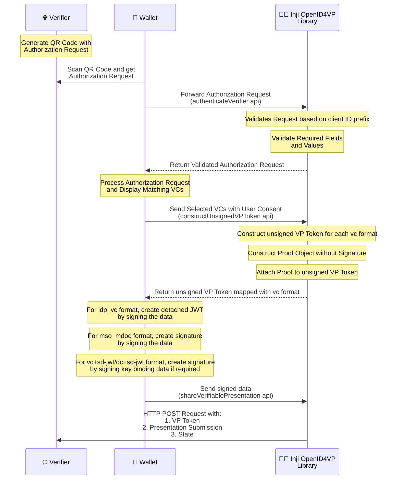

# OpenID4VP - Online Sharing

The Inji Wallet supports OpenID4VP specification V1.0 and draft 23.

This document provides a comprehensive overview of the process of sending a Verifiable Presentation to Verifiers who request them online. It adheres to the OpenID4VP [V1.0 specification](https://openid.net/specs/openid-4-verifiable-presentations-1_0.html) and [draft 23 specification](https://openid.net/specs/openid-4-verifiable-presentations-1_0-23.html) which outlines the standards for
requesting and presenting Verifiable Credentials. The implementation leverages the Inji OpenID4VP library to streamline the handling of OpenID4VP-related operations.

## Overview

- The implementation follows OpenID for Verifiable Presentations Specification.

- Below are the fields we expect in the Authorization Request:

  - client_id
  - presentation_definition/presentation_definition_uri for Draft 23 based requests (OR) dcql_query
  - response_type
  - response_mode (direct_post and direct_post.jwt)
  - nonce (Optional)
  - state (Optional)
  - response_uri
  - client_metadata (Optional)

  The specification also allows the Verifier to send Authorization Request by reference. It uses the parameters `request_uri` and `request_uri_method` (Optional) to send the authorization request as a URL reference. This can help reduce the size of the QR code and improve security by not exposing sensitive information.

  **Note** : Sharing **_wallet metadata_** is supported as part of this version. It can be shared to the verifier when the verifier sends Authorization request by reference and `request_uri_method` is **POST**.

  - When request_uri is passed as part of the authorization request parameters, below are the expected fields:

    - client_id
    - request_uri
    - request_uri_method (Optional | Default value : GET)

  - Sequence Diagram - Obtain Authorization Request by Reference

  ```mermaid
  sequenceDiagram
    participant Verifier as 🌐 Verifier
    participant Inji_Wallet as 📱Inji Wallet
    participant User as 🙋 User

    Verifier->>User: 1. Display Authorization Request as QR Code
    User-->>Verifier: 2. Scan QR Code via Inji Wallet
    Inji_Wallet->>Inji_Wallet: 3. Extract parameters from QR Code and<br/> validate the parameters
    Inji_Wallet->>Verifier: 4. Send request to request_uri with Wallet Metadata
    Verifier->>Inji_Wallet: 5. Return Authorization Request Object
  ```

The implementation of this feature involves the following steps:

1. The Verifier displays the Authorization Request to the End-User as a QR Code with parameters like `client_id`, `request_uri` and optionally `request_uri_method`
2. The Wallet scans the QR Code and extracts the parameters and validates the parameters in the request.
  - In case the client ID prefix is `pre-registered`, the Wallet also checks whether the `client_id` and `request_uri` are available in its trusted verifiers list for privacy considerations.
  - For other client ID prefixes, the usual validation is done based on the `client_id` value.
3. The Wallet then sends a request to the Verifier's `request_uri` value that is provided in the QR Code.
4. The Verifier processes the request and returns the Authorization request object as jwt.
5. Once the Wallet receives the Authorization Request Object, it extracts the object and first validates the request by performing the following checks
   - The `client_id` values in the Authorization Request (QR code parameters) and Authorization Request Object (`request_uri` response) are identical, if not the process is terminated
6. After this extraction and initial check, the Wallet then proceeds with the next steps of validation and processing as per the client ID prefix.

**Note** : The pre-registered client ID prefix validation can be toggled on/off based on the optional boolean in walletConfig being sent to Inji OpenID4VP Library.

## Client ID Prefixes Supported

- Below are the supported Client Identifier Prefixes by the library:

  - **pre-registered** : This Client Identifier Prefix suggests that the verifier is already registered with the wallet and the trust is already established. The request must be signed when shared by reference. The request can be signed or unsigned when shared by value.

  - **redirect_uri**: When the Client Identifier Prefix is `redirect_uri`, it specifies that the client ID is the Verifier's response URI. In this case, the Authorization Request must not be signed.

  - **decentralized_identifier** (OR) **did** : The request must be signed with a private key linked to the DID, and the corresponding public key must be retrieved from the DID Document via DID Resolution. The specific key used must be identified using the kid in the JOSE header. All other Verifier metadata must be provided through the client_metadata parameter.

## Verifiable Credential Format Supported for Sharing:

- ldp_vc
- mso_mdoc
- vc+sd-jwt
- dc+sd-jwt

## Implementation

The Inji Wallet integrates the Inji OpenID4VP library to manage all OpenID4VP-related functionalities. The library handles the core operations including validating incoming authorization requests, constructing Verifiable Presentations, and transmitting responses to verifiers. The Wallet's role focuses on two key responsibilities:

* Owns user consent and credential selection
* Performs secure cryptographic signing

### Inji OpenID4VP Libraries

- Android: `inji-openid4vp-android` - https://github.com/inji/inji-openid4vp
- iOS (Swift): `inji-openid4vp-ios-swift` - https://github.com/inji/inji-openid4vp-ios-swift

## Functionalities

##### Authorization Request Handling:

- The Verifier will generate a QR code with authorization request.
- Wallet scans the QR code to get the Authorization request and sends the authorization request to the library along with the trusted verifiers and boolean to validate the client.
- Library decodes and parses the Verifier's encoded Authorization Request received from the Wallet.
  <br>**Note** : When request_uri is present in the request, the actual authorization request is retrieved by making a request to the request_uri.
- Authenticates the Verifier based on the client ID prefix in the Authorization Request and returns the valid Authorization Request to the Wallet.
  <br>**Note** : Only when the client ID prefix is pre-registered can the validation be toggled on/off based on the boolean.

##### Match Credentials against VP Request

- Wallet matches the available credentials against the VP Request. In this flow, the VP Request may contain one of the following:
1. DCQL query - The Inji OpenID4VP library is used for this path. The `getMatchingCredentials` method is exposed by the library to handle this. (For detailed information, refer to [dcql-query-support.md](./dcql-query-support.md) on how credentials are matched.)
2. Presentation definition - The Wallet itself performs the credential matching logic.

##### User Review and Consent

1. After matched credentials are obtained, they are shown to the user for selection or review.
2. After users review, they provide consent for sharing.

##### Credential selection and sending response:

- Wallet reads the authorization request and sends the list of matching verifiable credentials to the library.
- Library receives the list of verifiable credentials(VC's) from the Wallet which are selected by the end user based on the claims requested.
- Constructs the unsigned verifiable presentation token data and sends it to the Wallet for generating the signature.
- Wallet signs on the unsigned verifiable presentation token data and sends the signature along with other details to the library.
- Library receives the signature, creates VP response data, and sends a POST request with the generated `vp_token` and `presentation_submission` to the Verifier `response_uri` endpoint.



## Summary: Wallet's Role in OpenID4VP Support

| Task                                     | Who        | Where                                          |
|------------------------------------------|------------|------------------------------------------------|
| **Authenticate Verifier**                | Library    | `authenticateVerifier()`                       |
| **Parse Authorization Request**          | Library    | Request parsing based on client ID prefix      |
| **Match credentials against VP request** | **Wallet** | Presentation Exchange matching logic           |
| **Display UI for credential selection**  | **Wallet** | `MatchingVcListContainer` / selection screens  |
| **Handle user consent**                  | **Wallet** | Consent confirmation & credential selection    |
| **Construct unsigned VP token**          | Library    | `constructUnsignedVPToken()`                   |
| **Sign VP token data**                   | **Wallet** | `signDataForVpPreparation()` (format-specific) |
| **Submit VP response to Verifier**       | Library    | `shareVerifiablePresentation()`                |

**Key Insight:** The library handles the OpenID4VP protocol orchestration (Verifier authentication, request parsing, VP token construction, and response submission). The Wallet handles credential matching for Presentation Exchange flows, user interaction, and cryptographic signing operations.

---

**Note:**
Holder binding support - The holder binding is a feature that allows the Verifier to ensure that the Verifiable Presentation is being presented by the same holder that holds the Verifiable Credentials.

- for ldp_vc format
  - Supported for VCs signed with signature suite **_Ed25519Signature2020_**.
- for vc+sd-jwt and dc+sd-jwt format
  - Via [cnf](https://www.ietf.org/archive/id/draft-ietf-oauth-sd-jwt-vc-10.html#section-3.2.2.2-3.4.2.1) claim and supported for `kid` only
  - Supported algorithms - **_ES256_**, **_Ed25519_**.

## Wallet Configuration for the OpenID4VP Flow

The wallet retrieves its OpenID4VP configuration from the backend service (**Mimoto**). This includes the list of trusted verifiers, client validation settings, and wallet capabilities.

### 1. Pre-registered Verifiers

The wallet obtains the list of pre-registered (trusted) verifiers from the Mimoto backend.

- **Backend Service:** Mimoto
- **API:** `/v1/mimoto/verifiers`

The response contains the list of trusted verifiers. This list is included in the `walletConfig` passed to the Inji OpenID4VP library, which uses it to perform **client validation** during the OpenID4VP flow.

#### Sample Response

```json
{
  "response": {
    "verifiers": [
      {
        "client_id": "verifier.com",
        "redirect_uris": [
          "https://verifier.com/"
        ],
        "response_uris": [
          "https://verifier.com/v1/verify/vp-submission/direct-post"
        ],
        "jwks_uri": "https://verifier.com/.well-known/jwks.json",
        "allow_unsigned_request": true,
        "spec_version": "draft23"
      },
      {
        "client_id": "mock-client",
        "redirect_uris": [
          "https://example.com/redirect"
        ],
        "response_uris": [
          "https://mock-client.com/verifier/vp-response"
        ],
        "jwks_uri": "https://mock-client.com/.well-known/jwks.json",
        "allow_unsigned_request": true,
        "spec_version": "v1"
      }
    ]
  }
}
```


### 2. Pre-registered Client Validation

Whether the wallet validates a verifier against the trusted verifier list is controlled by the `openid4vpClientValidation` property returned by the Mimoto backend.

- **Backend Service:** Mimoto
- **API:** `/v1/mimoto/allProperties`
- **Property:** `openid4vpClientValidation`

#### Behavior

- If `openid4vpClientValidation` is set to `true`, the wallet validates the verifier against the pre-registered verifier list.
- If `openid4vpClientValidation` is set to `false`, this validation is skipped.
- If the property is not present in the API response, the default value is `true`.


### 3. OpenID4VP Wallet Configuration

The wallet retrieves its OpenID4VP configuration from the Mimoto backend.

- **Backend Service:** Mimoto
- **API:** `/v1/mimoto/allProperties`
- **Property:** `openid4vpWalletConfig`

This property defines the wallet capabilities supported by the OpenID4VP library. If the property is not available, the [default configuration](../../shared/openID4VP/walletConfig/WalletConfig.ts) is used.

#### Configuration Parameters

The configuration includes:

- `response_types_supported` – Supported response types.
- `vp_formats_supported` – Supported Verifiable Presentation formats and their cryptographic algorithms.
- `client_id_prefixes_supported` – Supported client identifier prefixes.
- `request_object_signing_alg_values_supported` – Supported request object signing algorithms.
- `authorization_encryption_alg_values_supported` – Supported key management algorithms for encrypted authorization requests.
- `authorization_encryption_enc_values_supported` – Supported content encryption algorithms.
- `presentation_definition_uri_supported` – Indicates whether `presentation_definition_uri` is supported.
- `request_uri_methods_supported` – Supported HTTP methods for fetching request objects.

#### Sample Response

```json
{
  "response": {
    "openid4vpClientValidation": "false",
    "openid4vpWalletConfig": "{\"response_types_supported\":[\"vp_token\"],\"vp_formats_supported\":{\"mso_mdoc\":{\"issuerauth_alg_values\":[-7],\"deviceauth_alg_values\":[-7]},\"ldp_vc\":{\"proof_type_values\":[\"Ed25519Signature2020\",\"JsonWebSignature2020\"]},\"dc+sd-jwt\":{\"sd-jwt_alg_values\":[\"EdDSA\",\"ES256\"],\"kb-jwt_alg_values\":[\"ES256\",\"EdDSA\"]},\"vc+sd-jwt\":{\"sd-jwt_alg_values\":[\"EdDSA\",\"ES256\"],\"kb-jwt_alg_values\":[\"ES256\",\"EdDSA\"]}},\"client_id_prefixes_supported\":[\"redirect_uri\",\"decentralized_identifier\",\"pre-registered\"],\"request_object_signing_alg_values_supported\":[\"EdDSA\"],\"authorization_encryption_alg_values_supported\":[\"ECDH-ES\"],\"authorization_encryption_enc_values_supported\":[\"A256GCM\"],\"presentation_definition_uri_supported\":true,\"request_uri_methods_supported\":[\"get\",\"post\"]}"
  }
}
```
