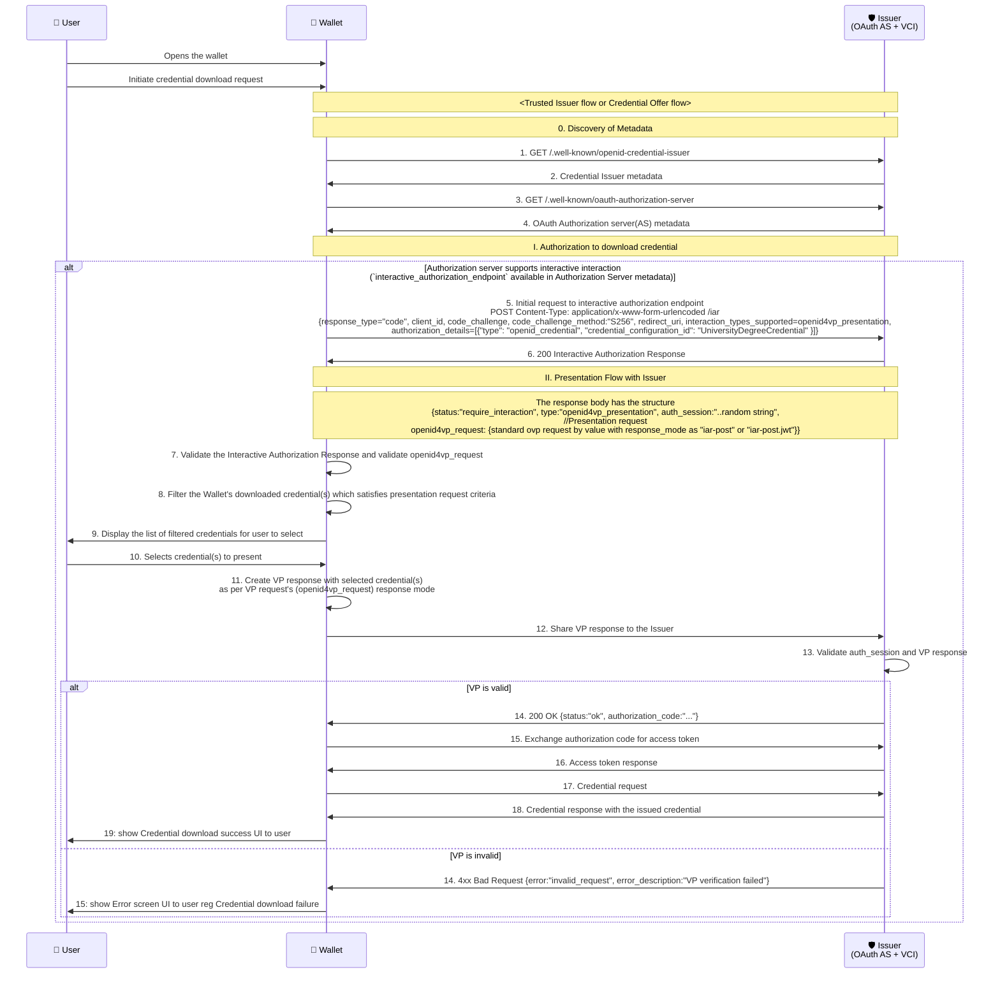
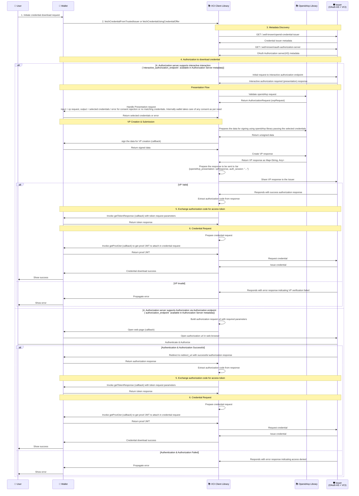

# Presentation During Issuance

When issuing credentials to a user, authentication or authorization is often required. The most common factor used is an OTP. However, using OTPs means the user must recall their identifier each time they access their credential. To simplify this, the specification allows submitting an existing credential to authorize the user for credential issuance — a process known as Presentation during Issuance.
In essence, it means presenting one credential to obtain another.

Example use cases:

- To issue a Student ID Credential, the user presents an Enrollment Credential issued by the educational institution.
- To issue a Health Insurance Credential, the user presents an Identity Credential issued by a government authority.

This document focuses on the technical design to support presentations during the issuance process, particularly in scenarios where the issuer requires a presentation to be made before issuing a credential.

## Specification References

- [OpenID for Verifiable Credential Issuance 1.1 - Editor's draft](https://openid.github.io/OpenID4VCI/openid-4-verifiable-credential-issuance-1_1-wg-draft.html)
- [OpenID for Verifiable Presentations 1.0](https://openid.net/specs/openid-4-verifiable-presentations-1_0.html)
- [OAuth 2.0 Pushed Authorization Requests](https://www.rfc-editor.org/info/rfc9126)
- [The OAuth 2.0 Authorization Framework](https://www.rfc-editor.org/info/rfc6749)
- [DIF Presentation Exchange](https://identity.foundation/presentation-exchange/)

## Clarifications

- The OVP request received is no different from current OVP request (DIF Presentation Exchange) structure followed in Wallet. ([Draft 23 OpenID4VP specification using DIF presentation exchange](https://openid.net/specs/openid-4-verifiable-presentations-1_0-ID3.html#name-dif-presentation-exchange-2).)
- The VP response created is also similar to the current VP response (DIF Presentation Exchange) structure followed in Wallet. ([Draft 23 VP response (Presentation Exchange)](https://openid.net/specs/openid-4-verifiable-presentations-1_0-ID3.html#name-examples-presentation-excha).)
- Wallet supports for `openid4vp_presentation` interaction type only. Other interaction types like `redirect_to_web` will be supported in the future.

### Future scope

- `redirect_to_web` interaction type support during issuance.

## Pre-requisites

- The Issuer supporting the Interactive Authorization Request Endpoint as per the specification.

## Terminologies

- OAuth AS: OAuth Authorization Server
- VCI: Verifiable Credential Issuer
- OVP: OpenID for Verifiable Presentations
- VP: Verifiable Presentation
- IAR: Interactive Authorization Request

## Credential Download with Presentation During Issuance

### Actors involved

1. **User**: The individual requesting the credential.
2. **Wallet - Inji Wallet**: The digital wallet application used by the user to manage credentials.
3. **Issuer (OAuth AS + VCI)**: The entity responsible for issuing the credential, which also acts as an OAuth Authorization Server and Verifiable Credential Issuer.

### Sequence of interactions between entities for Presentation during Issuance flow



## Credential Download Via Inji VCI Client Library

### Actors involved
1. **User**: The individual requesting the credential.
2. **Wallet - Inji Wallet**: The digital wallet application used by the user to manage credentials.
3. **VCI Client library**: The _inji-vci-client_ library that facilitates the credential download process.
4. **Openid4vp Library**: The _inji-openid4vp_ library used for handling OpenID for Verifiable Presentations.
5. **Issuer (OAuth AS + VCI)**: The entity responsible for issuing the credential, which also acts as an OAuth Authorization Server and Verifiable Credential Issuer.

### Flows involved

1. Download initiation by User
  1. Download credential from Trusted Issuer
  2. Download credential using Credential Offer
2. Authorization to download credential
  1. Authorization Code Flow supporting two modes:
    1. Interactive Authorization Flow (using `interactive_authorization_endpoint`) - Presentation during Issuance
    2. Authorization Flow via Authorization Endpoint (using `authorization_endpoint`)

### Sequence diagram of Credential download flow via Inji VCI client library



### Detailed Steps:

#### 1. Initiate Credential Download Request

   - The user initiates a credential download request in the Wallet application.
   - For the Trusted Issuer flow, the User opens the wallet and selects a credential to download from the list of trusted issuers.
   - For the Credential Offer flow, the User opens the wallet and scans the QR code to download using a received credential offer.


#### 2. Fetch Credential from Trusted Issuer or Using Credential Offer

Based on the chosen flow, the Wallet invokes either `fetchCredentialFromTrustedIssuer` or `fetchCredentialUsingCredentialOffer` method from the _inji-vci-client_ library, providing the necessary parameters and callbacks to handle the credential download process.

```kotlin
    fetchCredentialFromTrustedIssuer(
        credentialIssuer,
        credentialConfigurationId,
        clientMetadata,
        getTokenResponse,
        authorizations: listOf(
            AuthorizationMethod.PresentationDuringIssuance(selectCredentialsForPresentation, signVerifiablePresentation, signatureSuite),
            AuthorizationMethod.RedirectToWeb(openWebPage)
        )
    )
                // OR
    fetchCredentialUsingCredentialOffer(
        credentialOffer,
        clientMetadata,
        getTxCode,
        authorizations: listOf(
          AuthorizationMethod.PresentationDuringIssuance(selectCredentialsForPresentation, signVerifiablePresentation, signatureSuite),
          AuthorizationMethod.RedirectToWeb(openWebPage)
        ),
        getTokenResponse,
        getProofJwt,
        onCheckIssuerTrust,
        downloadTimeoutInMillis
    )
```

Note:
- VCIClient exposes the AuthorizationMethod class.When consumers use this class, all OVP-related processing is handled internally by using `inji-openid4vp` library.
- The wallet only needs to supply the required wallet communications via callbacks for credential selection, signing data during VP creation and signature suite used for signing.


#### 3. Metadata Discovery

- The _inji-vci-client_ performs discovery by fetching the Issuer Metadata and OAuth Authorization Server Metadata.

#### 4. Authorization to Download Credential

- It then checks if the Authorization Server supports interactive authorization by looking for the `interactive_authorization_endpoint` in the Authorization Server metadata or uses the `authorization_endpoint` available in the metadata for the authorization process.

##### **Interactive Authorization Flow:**

Note: The Current implementation supports only Interactive Authorization flow for Presentation during Issuance

- As a first step, the _inji-vci-client_ makes an initial request to the interactive authorization endpoint, including the details as below
```shell
POST Content-Type: application/x-www-form-urlencoded /iar
{
  "response_type": "code",
  "client_id": "<client_id>",
  "code_challenge": "<code_challenge>",
  "code_challenge_method": "S256",
  "redirect_uri": "<redirect_uri>",
  "interaction_types_supported": "openid4vp_presentation",
  "authorization_details": [
    {
      "type": "openid_credential",
      "credential_configuration_id": "UniversityDegreeCredential"
    }
  ]
}
```
- The Issuer responds with a 200 OK response, indicating that interactive authorization is required, along with the OVP request in the response body. The OVP request has the response mode as either `iar_post` or `iar_post.jwt` .The OVP request has the following structure:
```shell
{
  "status": "require_interaction",
  "type": "openid4vp_presentation",
  "auth_session": "..random string",
  "openid4vp_request": {
    {
      "client_id": "did:example:123456",
      "response_uri": "https://client.example.org/post",
      "response_type": "vp_token",
      "response_mode": "iar_post",
      "presentation_definition": {
        "input_descriptors": [
          {
            "id": "id card credential",
            "format": {
              "ldp_vc": {
                "proof_type": [
                  "Ed25519Signature2018"
                ]
              }
            },
            "constraints": {
              "fields": [
                {
                  "path": [
                    "$.type"
                  ],
                  "filter": {
                    "type": "string",
                    "pattern": "IDCardCredential"
                  }
                }
              ]
            }
          }
        ]
      },
      "nonce": "...nonce",
      "state" : "...state",
      "id": "vp token example",
    }
  }
}
```
  - The _inji-vci-client_ validates the Interactive Authorization Response and the OVP request using the `inji-openid4vp` library.
  - The _inji-vci-client_ then prepares to handle the presentation request
    - Firstly, _inji_vci_client_ invokes the Wallet's callback to select credentials for presentation.
    - The Wallet processes the OVP request, filters the user's downloaded credentials based on the presentation request criteria, and displays the filtered credentials for the user to select.
    - The user selects the credential(s) to present.
    - The Wallet then returns the selected credentials to the _inji-vci-client_.
    - Next, the _inji-vci-client_ prepares the data for signing using the `inji-openid4vp` library, passing the selected credentials.
    - The _inji-openid4vp_ library returns the unsigned data to the _inji-vci-client_.
    - The _inji-vci-client_ invokes the Wallet's callback to sign the data for VP creation.
    - The Wallet signs the data and returns the signed data to the _inji-vci-client_.
    - The _inji-vci-client_ then creates the VP response using the `inji-openid4vp` library.
    - The `inji-openid4vp` library returns the VP response as a Map<String, Any> to the _inji-vci-client_.
  - The _inji-vci-client_ prepares the response to be sent to the Issuer's /iar endpoint, including the VP response and auth_session.
  - Finally, the _inji-vci-client_ shares the VP response to the Issuer's /iar endpoint.

```shell
POST /iar
Content-Type - application/x-www-form-urlencoded
{
  "auth_session": "...",
  "openid4vp_presentation": {
    "vp_token": <VP Token>,
    "presentation_submission": <Presentation Submission>
   }
}
```
  - The Issuer validates the auth_session and VP response.
    - If the VP is valid, the Issuer responds with a 200 OK response, including the authorization code in the response body. The _inji-vci-client_ extracts the authorization code from the response and proceeds to exchange it for an access token.
    ```shell
    {
      "status": "ok",
      "authorization_code": "..."
    }
    ```

    - If the VP is invalid, the Issuer responds with a 4xx Bad Request error, indicating that the VP verification failed. The _inji-vci-client_ propagates the error to the Wallet, which then shows an error screen to the user regarding the credential download failure.
      ```shell
      {
        "error": "invalid_request",
        "error_description": "VP verification failed"
      }
      ```

##### **Authorization Flow via Authorization Endpoint:**

- If the Authorization Server supports non-interactive authorization, the _inji-vci-client_ builds the authorization request URL with the required parameters (as shown below):
```shell
/authorize?
  response_type=code
  &client_id=redirect_uri%3Ahttps%3A%2F%2Fclient.example.org%2Fcb
  &redirect_uri=https%3A%2F%2Fclient.example.org%2Fcb
  &presentation_definition=...
  &transaction_data=...
  &nonce=n-0S6_WzA2Mj HTTP/1.1
```
- It then invokes the Wallet's callback to open the web page.
- The Wallet opens the authorization URL in a web browser.
- The user authenticates and authorizes the request in the web browser.
- If authentication and authorization are successful, the Issuer redirects to the redirect_uri with the authorization response, including the authorization code (as shown below):
```shell
{
  "status": "ok",
  "code: "..."
}
```

  - The Wallet returns the authorization response to the _inji-vci-client_. The _inji-vci-client_ extracts the authorization code from the response and proceeds to exchange it for an access token.
- If authentication and authorization fail, the Issuer responds with an error response (as shown below):
```shell
{
  "error": "access_denied",
  "error_description": "The resource owner or authorization server denied the request."
}
```
- The _inji-vci-client_ propagates the error to the Wallet, which then shows an error screen to the user regarding the credential download failure.

#### 5. Exchange Authorization Code for Access Token

- The _inji-vci-client_ invokes the Wallet's `getTokenResponse` callback function with the token request parameters to exchange the authorization code for an access token.
```shell
{
  "grant_type": "authorization_code",
  "token_endpoint": "https://issuer.example.com/token",
  "auth_code": "sample_auth_code", # Authorization code received from previous step
  "pre_auth_code": null,
  "tx_code": null,
  "client_id": "client_123",
  "redirect_uri": "https://client.example.com/cb",
  "code_verifier": "sample_code_verifier"
}
```
- The Wallet processes the token request and returns the token response to the _inji-vci-client_.
```shell
{
    "access_token": <access_token>,
    "token_type": "bearer",
    "expires_in": 86400,
    "c_nonce": "tZignsnFbp",
    "c_nonce_expires_in": 86400
```


#### 6. Credential Request

- The _inji-vci-client_ prepares the credential request.
- It then invokes the Wallet's `getProofJwt` callback function to get the proof JWT to attach in the credential request.
- The Wallet creates the proof JWT and returns it to the _inji-vci-client_.
- The _inji-vci-client_ requests the credential from the Issuer, attaching the proof JWT.
- The Issuer issues the credential and responds to the _inji-vci-client_.
```shell
# Successful Credential Response
{
  "credential": <issued_credential>,
}
```
- Finally, the _inji-vci-client_ notifies the Wallet of the successful credential download, and the Wallet shows a success message to the user.


